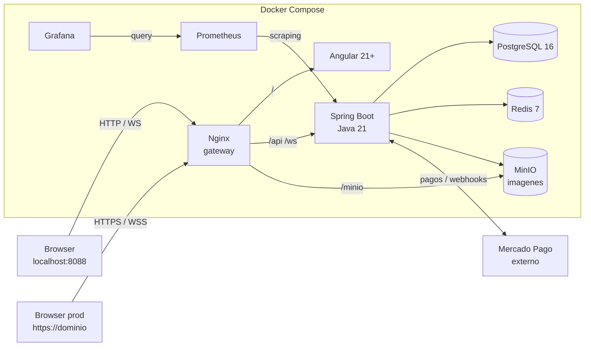

# Codemon TCG

Codemon TCG es un juego de cartas coleccionables online inspirado en Pokemon TCG, construido como Trabajo Practico Integrador de Programacion III - UTN-FRC.

El proyecto permite jugar partidas en tiempo real con mazos de 60 cartas del set **XY1** (146 cartas), coleccionar cartas, abrir sobres, armar mazos, competir por ranking y enfrentarse a un bot con personalidad argentina.

---

## Que es

Codemon TCG es una aplicacion fullstack que integra frontend, backend, base de datos, tiempo real e infraestructura Docker para ofrecer una experiencia jugable de cartas coleccionables.

Incluye:

- Autenticacion con JWT, refresh tokens y 2FA por email.
- Catalogo de cartas XY1 con imagenes almacenadas en MinIO.
- Coleccion personal, apertura de sobres y tienda con Mercado Pago sandbox.
- Constructor y validador de mazos.
- Partidas PvE contra bot, salas privadas y matchmaking ranked por ELO.
- Comunicacion en tiempo real por WebSocket STOMP.
- Ranking, estadisticas, perfil de usuario y monitoreo con Prometheus/Grafana.

---

## Stack tecnologico

| Capa | Tecnologia |
|---|---|
| Backend | Java 21 · Spring Boot 3.x · Spring Security · WebSocket STOMP |
| Frontend | Angular 21+ · TypeScript strict · Tailwind CSS 3 · SockJS/StompJS |
| Base de datos | PostgreSQL 16 · Flyway (15 migraciones) · Redis 7 |
| Almacenamiento | MinIO · 292 imagenes de cartas (small + large) |
| Gateway | Nginx · local `http://localhost:8088` · produccion `https://<dominio>` |
| Monitoreo | Prometheus · Grafana |
| Pagos | Mercado Pago API (sandbox) |
| Testing | JUnit 5 · Mockito · Testcontainers · Playwright E2E |

Mas detalle: [docs/01-producto/TECNOLOGIAS.md](docs/01-producto/TECNOLOGIAS.md).

---

## Arquitectura



El entorno local usa Nginx como gateway unico en `http://localhost:8088`. Para despliegue productivo, Nginx termina HTTPS en `443`, redirige `80 -> 443` y mantiene WebSocket seguro por `wss://<dominio>/ws`.

- Gateway local: [docs/07-infraestructura/GATEWAY_LOCAL.md](docs/07-infraestructura/GATEWAY_LOCAL.md)
- Produccion HTTPS: [docs/07-infraestructura/GATEWAY_PRODUCCION_HTTPS.md](docs/07-infraestructura/GATEWAY_PRODUCCION_HTTPS.md)

---

## Arranque rapido

```bash
# 1. Variables de entorno
cp .env.example .env
# Editar .env: completar MP_ACCESS_TOKEN, EMAIL_USERNAME, EMAIL_PASSWORD

# 2. Levantar el stack completo
docker compose up -d --build

# 3. Abrir la aplicacion
open http://localhost:8088
```

Verificacion rapida:

```bash
curl http://localhost:8088/actuator/health
curl http://localhost:8088/api/cards?size=3
```

Si vas a desarrollar o necesitas mas comandos, lee [CONTRIBUTING.md](CONTRIBUTING.md).

---

## Servicios principales

| Servicio | URL |
|---|---|
| Aplicacion (gateway) | http://localhost:8088 |
| Swagger UI | http://localhost:8088/swagger-ui.html |
| Grafana | http://localhost:3000 |
| Prometheus | http://localhost:9090 |
| MinIO Console | http://localhost:9001 |
| PostgreSQL | localhost:5433 |

Credenciales locales y detalles de verificacion: [CONTRIBUTING.md](CONTRIBUTING.md#servicios-y-verificacion).

---

## Estructura del repositorio

```text
codemon/
├── api/                         Backend Spring Boot (Java 21)
├── front/                       Frontend Angular 21+
├── infra/monitoring/            Prometheus + Grafana
├── scripts/                     Tooling de verificacion, trazabilidad y sync
├── docs/                        Documentacion completa del proyecto
├── docker-compose.yml           Stack completo local
├── docker-compose.prod.yml      Overlay productivo HTTPS
├── .env.example                 Plantilla de variables de entorno
├── .env.production.example      Plantilla de variables productivas
└── CONTRIBUTING.md              Guia para desarrolladores
```

Mapa completo de documentacion: [docs/INDICE.md](docs/INDICE.md).

---

## Documentacion

| Quiero... | Leer |
|---|---|
| Entender el proyecto como visitante | [README.md](README.md) |
| Trabajar en el proyecto | [CONTRIBUTING.md](CONTRIBUTING.md) |
| Ver el mapa completo de docs | [docs/INDICE.md](docs/INDICE.md) |
| Empezar desde cero como dev | [docs/03-equipos/GUIA_PRIMER_DIA.md](docs/03-equipos/GUIA_PRIMER_DIA.md) |
| Revisar la especificacion funcional del producto | [docs/01-producto/ESPECIFICACION_PRODUCTO.md](docs/01-producto/ESPECIFICACION_PRODUCTO.md) |
| Consultar planificacion Scrum | [docs/02-planificacion/README.md](docs/02-planificacion/README.md) |
| Ver contratos de API | [docs/05-referencia-tecnica/CONTRATOS_API.md](docs/05-referencia-tecnica/CONTRATOS_API.md) |
| Consultar reglas del juego | [docs/06-reglas-juego/REGLAS_INDEX.md](docs/06-reglas-juego/REGLAS_INDEX.md) |

---

## Organizacion del trabajo

El proyecto se organiza con Scrum, sprints semanales, tres equipos de trabajo y gates de sincronizacion entre frontend, backend e infraestructura.

- Planificacion, backlog, sprints y gates: [docs/02-planificacion/README.md](docs/02-planificacion/README.md)
- Equipos y responsabilidades: [docs/02-planificacion/04_proceso/EQUIPOS.md](docs/02-planificacion/04_proceso/EQUIPOS.md)
- Guias por equipo: [docs/03-equipos/](docs/03-equipos/)

---

## Integrantes

<table>
  <tr>
    <td align="center">
      <a href="https://github.com/facundosoria">
        <br/>
        <sub><b>Facu</b></sub>
      </a>
    </td>
    <td align="center">
      <a href="https://github.com/Brf93">
        <br/>
        <sub><b>Franco</b></sub>
      </a>
    </td>
    <td align="center">
      <a href="https://github.com/421498-1w1-Fernandez-Gonzalo">
        <br/>
        <sub><b>Gonza</b></sub>
      </a>
    </td>
    <td align="center">
      <a href="https://github.com/zamjoaco">
        <br/>
        <sub><b>Joaco</b></sub>
      </a>
    </td>
    <td align="center">
      <a href="https://github.com/412432-Castelli-Nicolas-Francisco">
        <br/>
        <sub><b>Nico</b></sub>
      </a>
    </td>
    <td align="center">
      <a href="https://github.com/Rafacastro421272">
        <br/>
        <sub><b>Rafa</b></sub>
      </a>
    </td>
  </tr>
</table>
