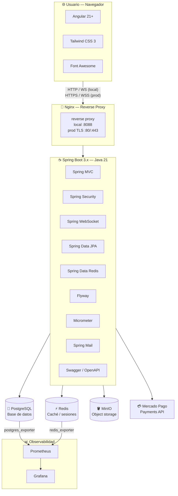

# TECNOLOGIAS.md
# Todas las tecnologías de Codemon — qué son, para qué sirven y cómo las usás

---

## Mapa general



---

## BACKEND

---

### Java 21

**Qué es:** Lenguaje de programación orientado a objetos. Versión 21 es la LTS (Long Term Support) más reciente al momento del proyecto.

**Para qué lo usás:** Es el lenguaje en el que escribís toda la lógica del backend: el motor de juego, los servicios de autenticación, los controladores REST, etc.

**Por qué Java 21 específicamente:** Trae Records, Pattern Matching y Virtual Threads (Project Loom), que mejoran la legibilidad y el manejo de concurrencia. Además es el requerimiento del TPI.

**Cómo lo integrás:** Todo el código del directorio `api/src/main/java/` es Java.

---

### Spring Boot 3.x

**Qué es:** Framework que simplifica la creación de aplicaciones Java. En vez de configurar cientos de cosas a mano, Spring Boot las configura automáticamente con valores sensatos y te deja sobreescribir lo que necesitás.

**Para qué lo usás:** Es la base de toda la API. Spring Boot arranca la aplicación, configura la conexión a la base de datos, levanta el servidor web, gestiona los beans (componentes), y conecta todo con anotaciones simples.

**Cómo lo integrás:** El archivo `pom.xml` declara `spring-boot-starter-parent` como padre del proyecto. Al arrancar con `./mvnw spring-boot:run` o dentro de Docker, Spring Boot lee el `application.yml` y configura todo automáticamente.

**Módulos de Spring Boot que usás:**

---

### Spring MVC (Spring Web)

**Qué es:** El módulo que convierte métodos Java en endpoints HTTP.

**Para qué lo usás:** Crear todos los endpoints REST de la API: `GET /cards`, `POST /auth/login`, `POST /games/{id}/action`, etc.

**Cómo lo integrás:** Con anotaciones como `@RestController`, `@GetMapping`, `@PostMapping` sobre las clases en las carpetas `controller/` de cada dominio. El frontend Angular consume estos endpoints.

---

### Spring Security

**Qué es:** El módulo de seguridad de Spring. Intercepta cada request y decide si está autorizada o no.

**Para qué lo usás:** Dos cosas:
1. Autenticación: verificar que el JWT que viene en el header `Authorization: Bearer ...` es válido y no expiró.
2. Autorización: bloquear acceso a endpoints protegidos si no hay token válido.

**Cómo lo integrás:** Configurás un `SecurityConfig` que define qué endpoints son públicos (register, login) y cuáles necesitan token. Un filtro `JwtAuthenticationFilter` revisa el token en cada request antes de que llegue al controller.

---

### Spring Data JPA + Hibernate

**Qué es:** JPA (Java Persistence API) es el estándar de Java para mapear objetos Java a tablas de base de datos. Hibernate es la implementación concreta. Spring Data JPA agrega repositories que generan el SQL automáticamente.

**Para qué lo usás:** En vez de escribir SQL a mano para cada consulta, anotás tus clases Java con `@Entity` y Spring genera automáticamente el INSERT, SELECT, UPDATE, DELETE. Para consultas específicas escribís solo el nombre del método y Spring lo interpreta.

**Cómo lo integrás:** Cada dominio tiene una carpeta `entity/` con las clases que representan las tablas, y una carpeta `repository/` con interfaces que extienden `JpaRepository`. Flyway crea las tablas, JPA las mapea.

---

### Flyway

**Qué es:** Herramienta de versionado de base de datos. Guarda un historial de todos los cambios del schema y los aplica en orden.

**Para qué lo usás:** En vez de crear las tablas a mano o que Hibernate las genere solo (lo cual es impredecible), vos escribís archivos SQL numerados (`V1__users.sql`, `V2__cards.sql`, etc.) y Flyway los ejecuta en orden al arrancar la API.

**Por qué es importante:** Si alguien clona el repo y corre la app, Flyway aplica automáticamente todas las migraciones y la BD queda idéntica a la tuya. Reproducible en cualquier máquina.

**Cómo lo integrás:** Los archivos SQL están en `api/src/main/resources/db/migration/`. Al arrancar la API, Flyway revisa qué migraciones ya ejecutó (las guarda en una tabla `flyway_schema_history`) y ejecuta solo las nuevas.

---

### Spring Data Redis

**Qué es:** El módulo que conecta Spring con Redis, un store de datos en memoria.

**Para qué lo usás:** En Codemon lo usás para 3 cosas específicas:
1. Cola de matchmaking: guardar los usuarios esperando rival en un "sorted set" ordenado por skill rating
2. Cooldown de sobres: guardar que un usuario ya abrió su sobre diario (con TTL de 24 horas)
3. Sesiones temporales y caché cuando sea necesario

**Cómo lo integrás:** Inyectás `RedisTemplate` en los servicios que lo necesitan (`MatchmakingService`, `BoosterPackService`) y lo usás como un mapa clave-valor muy rápido.

---

### Spring WebSocket + STOMP

**Qué es:** WebSocket es un protocolo de comunicación bidireccional en tiempo real entre cliente y servidor. STOMP (Simple Text Oriented Messaging Protocol) es una capa de mensajería sobre WebSocket que define canales y suscripciones.

**Para qué lo usás:** Sincronizar el juego en tiempo real entre los dos jugadores. Cuando el jugador 1 hace una acción, el servidor la procesa y envía el resultado al jugador 2 instantáneamente, sin que el jugador 2 tenga que hacer polling.

**Cómo lo integrás:** El backend expone un endpoint WebSocket en `/ws`. El frontend Angular se suscribe a canales (`/topic/game/{id}`) y recibe eventos como `DAMAGE_DEALT`, `POKEMON_KO`, `TURN_START` en tiempo real.

---

### Spring Mail

**Qué es:** El módulo de Spring para enviar emails.

**Para qué lo usás:** Enviar el código de verificación de 6 dígitos cuando un usuario se registra (2FA por email). El código tiene 30 minutos de validez.

**Cómo lo integrás:** `EmailService` usa `JavaMailSender` para enviar el email. Las credenciales del servidor SMTP van en el `.env` (Gmail con App Password, o Mailtrap para desarrollo).

---

### JWT (jjwt library)

**Qué es:** JSON Web Token. Un token firmado digitalmente que contiene información del usuario (como su ID y rol). Tiene una firma que solo el servidor puede verificar, así que no puede ser falsificado.

**Para qué lo usás:** Autenticación sin estado (stateless). Cuando el usuario hace login, recibe un access token (válido 15 minutos) y un refresh token (válido 7 días). El access token va en el header de cada request y el servidor verifica la firma sin consultar la BD.

**Cómo lo integrás:** La librería `jjwt` genera y valida los tokens en `JwtTokenProvider`. El `JwtAuthenticationFilter` intercepta cada request y verifica el token antes de que llegue al controller.

---

### Swagger / OpenAPI (springdoc)

**Qué es:** Herramienta que genera automáticamente documentación interactiva de tu API REST, leyendo las anotaciones de tus controllers.

**Para qué lo usás:** Documentar todos los endpoints. La UI de Swagger en `http://localhost:8088/swagger-ui.html` muestra todos los endpoints con sus parámetros y permite probarlos directamente desde el browser, sin Postman.

**Cómo lo integrás:** La librería `springdoc-openapi` lo genera automáticamente al leer tus `@RestController`, `@GetMapping`, etc. Sin configuración extra, ya tenés documentación.

---

### Bucket4j

**Qué es:** Librería de rate limiting para Java. Implementa el algoritmo "token bucket" para limitar la cantidad de requests por unidad de tiempo.

**Para qué lo usás:** Dos puntos críticos:
1. Verificación 2FA: máximo 5 intentos de código por usuario, bloqueo 15 minutos al superarlos
2. Reenvío de código: máximo 1 reenvío por minuto

**Cómo lo integrás:** En los servicios de autenticación, antes de procesar la acción, verificás si el usuario aún tiene "tokens disponibles" en su bucket. Si no tiene, rechazás la request con 429 Too Many Requests.

---

### Micrometer + Prometheus registry

**Qué es:** Micrometer es la librería de métricas de Spring. Recolecta automáticamente métricas de la JVM (CPU, memoria, GC, threads) y del servidor HTTP (latencia, requests/segundo, errores). La registry de Prometheus formatea esas métricas en el formato que Prometheus entiende.

**Para qué lo usás:** Exponer las métricas en `/actuator/prometheus` para que Prometheus las recolecte cada 15 segundos y Grafana las muestre.

**Cómo lo integrás:** Con solo agregar la dependencia `micrometer-registry-prometheus` al `pom.xml` y habilitar el endpoint en `application.yml`, ya tenés métricas automáticas de la JVM y HTTP. Además creás métricas de negocio custom (`CodemonMetrics`) para contadores como partidas activas, coins vendidos, etc.

---

### MinIO SDK (cliente Java)

**Qué es:** El cliente Java oficial de MinIO que permite subir y bajar archivos desde código Java.

**Para qué lo usás:** Al iniciar la aplicación, `CardSeedRunner` descarga las imágenes de las cartas desde `pokemontcg.io` y las sube a MinIO usando este SDK. Luego genera la URL pública de MinIO para guardarla en PostgreSQL.

**Cómo lo integrás:** `MinioService` encapsula el SDK y expone métodos simples: `uploadImage(path, bytes)` y `getPublicUrl(path)`.

---

### Mercado Pago SDK

**Qué es:** El SDK oficial de Mercado Pago para Java. Permite crear preferencias de pago y procesar webhooks.

**Para qué lo usás:** Cuando un usuario quiere comprar sobres, el backend crea una "preferencia de pago" en Mercado Pago que genera un link de pago. Cuando el usuario completa el pago, Mercado Pago envía un webhook al backend, que acredita las monedas virtuales.

**Cómo lo integrás:** `PaymentService` usa el SDK para crear preferencias (sandbox en desarrollo, producción en entrega). `WebhookController` recibe el webhook de Mercado Pago y lo procesa con idempotencia (para evitar acreditar dos veces si el webhook llega duplicado).

---

### JUnit 5 + Mockito

**Qué es:** JUnit 5 es el framework de testing de Java. Mockito es una librería que crea "mocks" (objetos falsos) para aislar lo que estás testeando de sus dependencias.

**Para qué lo usás:** Escribir tests unitarios para todos los servicios, especialmente los componentes del motor de juego (RuleValidator, DamageCalculator, StatusEffectManager, VictoryConditionChecker) que requieren ≥90% de cobertura.

**Cómo lo integrás:** Los tests están en `api/src/test/java/`. Con `./mvnw test` se ejecutan todos. Con `./mvnw test jacoco:report` se genera el reporte de cobertura en `target/site/jacoco/`.

---

### JaCoCo

**Qué es:** Java Code Coverage. Herramienta que mide qué porcentaje de tu código fue ejecutado durante los tests.

**Para qué lo usás:** Verificar que cumplís los requisitos de cobertura del TPI: ≥80% global, ≥90% en los componentes críticos del motor de juego.

**Cómo lo integrás:** Plugin en `pom.xml`. Al correr los tests, JaCoCo genera un reporte HTML que podés abrir en el browser y ver exactamente qué líneas de código nunca fueron testeadas.

---

### Testcontainers

**Qué es:** Librería que levanta contenedores Docker reales (PostgreSQL, Redis) durante los tests de integración y los destruye al terminar.

**Para qué lo usás:** Tests de integración que necesitan una base de datos real, no un mock. Por ejemplo, verificar que Flyway aplica todas las migraciones correctamente, o que una consulta JPA devuelve los datos correctos.

**Cómo lo integrás:** En los tests de integración, anotás la clase con `@Testcontainers` y declarás un `@Container` de PostgreSQL. Testcontainers arranca un contenedor de postgres, corre el test y lo destruye. Sin interferir con tu BD de desarrollo.

---

## FRONTEND

---

### Angular 21+

**Qué es:** Framework de Google para construir Single Page Applications (SPA) con TypeScript. Una SPA carga una sola vez y luego actualiza el contenido dinámicamente sin recargar la página.

**Para qué lo usás:** Toda la interfaz de usuario: el tablero de juego, el deck builder, la tienda de sobres, el leaderboard, el lobby, el chat. Angular maneja el routing entre páginas, los formularios, las llamadas a la API y la actualización de la UI.

**Cómo lo integrás:** El proyecto Angular está en `front/`. Con `ng serve` corrés el servidor de desarrollo. Con `ng build --configuration production` generás los archivos estáticos que Nginx sirve en producción.

**Por qué Angular 21+ (Standalone Components):** Las versiones modernas de Angular usan Standalone Components: cada componente es independiente, no necesita declararse en un NgModule. Es más simple y tiene mejor tree-shaking (archivos finales más pequeños).

---

### TypeScript (strict mode)

**Qué es:** Superconjunto tipado de JavaScript. Agrega tipos estáticos al lenguaje, lo que permite detectar errores en tiempo de compilación antes de que el código llegue al browser.

**Para qué lo usás:** Todo el código del frontend está en TypeScript. El modo strict está activado en `tsconfig.json`, lo que significa que no podés tener variables sin tipo ni `any` implícitos.

**Cómo lo integrás:** Angular usa TypeScript por defecto. Las interfaces en `shared/models/` definen los tipos de los objetos que vienen de la API, asegurando que el frontend no intente acceder a propiedades que no existen.

---

### Tailwind CSS 3

**Qué es:** Framework CSS *utility-first*. En vez de proveer componentes pre-armados, expone una librería de utilidades atómicas (clases como `flex`, `p-4`, `bg-blue-600`, `rounded-lg`, `md:grid-cols-3`) que componés directamente en el HTML para construir cualquier diseño sin escribir CSS adicional.

**Para qué lo usás:** Construir toda la UI del proyecto. El tablero de juego, las páginas de registro/login, el deck builder, la tienda y el leaderboard se maquetan combinando utilidades Tailwind directamente en los templates de los componentes Angular. Cuando una combinación se repite, se encapsula en una clase de componente con `@apply` dentro del `*.component.scss`.

**Cómo lo integrás:**

```bash
# Dependencias de desarrollo
npm install -D tailwindcss@3 postcss autoprefixer
npx tailwindcss init
```

`tailwind.config.js` en la raíz de `front/`:

```js
/** @type {import('tailwindcss').Config} */
module.exports = {
  content: ["./src/**/*.{html,ts}"],
  theme: { extend: {} },
  plugins: [],
};
```

`src/styles.scss` (primeras líneas):

```scss
@tailwind base;
@tailwind components;
@tailwind utilities;
```

`angular.json` debe seguir referenciando `src/styles.scss` en el bloque `"styles"`. Tailwind se inyecta vía las directivas `@tailwind` dentro de ese archivo, sin agregar otros CSS externos.

Uso en templates: `class="flex items-center gap-2 px-4 py-2 rounded bg-blue-600 text-white hover:bg-blue-700"`, `class="rounded-lg border border-gray-200 bg-white shadow-sm p-4"`, `class="grid grid-cols-1 md:grid-cols-2 lg:grid-cols-3 gap-4"`, etc.

**Responsive:** breakpoints estándar de Tailwind (`sm:` 640px, `md:` 768px, `lg:` 1024px, `xl:` 1280px). En el tablero, las zonas pasan a stack vertical con `flex flex-col md:flex-row`.

---

### FontAwesome

**Qué es:** Librería de íconos vectoriales (SVG). Tiene miles de íconos: corazones, espadas, monedas, cartas de juego, etc.

**Para qué lo usás:** Íconos en la interfaz: el ícono de espada para atacar, el ícono de corazón para HP, el ícono de moneda para las Codemones, el ícono de sobre para los booster packs, etc.

**Cómo lo integrás:** Instalado con npm, referenciado en `angular.json`. En los templates usás `<i class="fas fa-heart"></i>` para mostrar un ícono.

---

### @stomp/stompjs + SockJS

**Qué es:** `@stomp/stompjs` es el cliente STOMP para browser. `SockJS` es una librería que emula WebSockets en browsers que no los soportan, cayendo a alternativas como long-polling.

**Para qué lo usás:** Conectar el frontend al servidor WebSocket del backend para recibir eventos del juego en tiempo real: cuando el oponente ataca, cuando hay un KO, cuando es tu turno.

**Cómo lo integrás:** `WebSocketService` en Angular encapsula la conexión. Se suscribe a `/topic/game/{id}` para recibir eventos públicos y a `/user/queue/game` para eventos privados (como `CARD_DRAWN`). Cuando llega un evento, el `GameBoardComponent` actualiza la UI.

---

### @angular/cdk/drag-drop

**Qué es:** Módulo del Angular CDK (Component Development Kit) que provee funcionalidad de drag & drop.

**Para qué lo usás:** Requerimiento de RF-07: el jugador arrastra cartas de su mano al Pokémon Activo para adjuntar energías, arrastra Pokémon desde la mano a la Banca, arrastra una evolución sobre un Básico.

**Cómo lo integrás:** En el `GameBoardComponent`, los contenedores de cartas son `cdkDropList` y las cartas son `cdkDrag`. Cuando el jugador suelta una carta en un destino válido, el componente envía la acción correspondiente al backend.

---

### Angular HTTP Interceptors

**Qué es:** Middleware del HttpClient de Angular que intercepta todas las requests y responses HTTP.

**Para qué lo usás:** Dos interceptores:
1. `HttpJwtInterceptor`: agrega automáticamente el header `Authorization: Bearer {token}` a todas las requests que van al backend
2. `ErrorInterceptor`: captura errores 401 (token expirado) y llama al endpoint de refresh automáticamente, sin que el usuario note nada

**Cómo lo integrás:** Registrados en `app.config.ts`. Son transparentes: el código de los servicios Angular no tiene que preocuparse por el token, el interceptor lo agrega solo.

---

### Angular Guards

**Qué es:** Clases que Angular ejecuta antes de navegar a una ruta y pueden cancelar la navegación.

**Para qué lo usás:**
- `AuthGuard`: si el usuario no está logueado, redirige a `/auth/login`
- `EmailVerifiedGuard`: si el usuario está logueado pero no verificó su email, redirige a `/auth/verify-email`

**Cómo lo integrás:** Declarados en las rutas en `app.routes.ts` con `canActivate: [AuthGuard]`. Angular los ejecuta automáticamente antes de renderizar cada página.

---

### Nginx

**Qué es:** Servidor web y reverse proxy de alta performance.

**Para qué lo usás:** Dos roles en el proyecto:
1. Servidor de archivos estáticos: sirve el build de Angular (`index.html`, `.js`, `.css`)
2. Reverse proxy: redirige las llamadas a `/api/...` hacia el backend Spring Boot en `api:8080`

**Por qué es necesario en Docker:** En desarrollo, Angular corre en el puerto 4200 y la API en 8080, y Angular puede llamar directamente a `localhost:8080`. Pero en Docker, el frontend no puede llamar a `localhost:8080` porque están en contenedores distintos. Nginx resuelve esto: el browser llama a `/api/games` → Nginx lo redirige a `http://api:8080/games` internamente.

**Cómo lo integrás:** El `Dockerfile.front` tiene un stage 2 que copia el build de Angular a la imagen de Nginx y copia el `nginx.conf`. El `nginx.conf` define las reglas de proxy.

---

## BASE DE DATOS

---

### PostgreSQL 16

**Qué es:** Sistema de gestión de bases de datos relacional open source. Es uno de los más robustos y con más features del mercado.

**Para qué lo usás:** Es la base de datos principal del proyecto. Guarda absolutamente todo: usuarios, cartas, mazos, partidas, pagos, sobres, colecciones, historial de chat.

**Features específicas de PostgreSQL que aprovechás:**
- `JSONB`: tipo de dato para guardar JSON de forma indexable. Usás para guardar los ataques, debilidades y resistencias de las cartas, y el `state_json` completo de cada partida
- `TEXT[]`: arrays nativos de PostgreSQL. Usás para los tipos de Pokémon y subtipos
- Vistas materializadas: el leaderboard es una vista materializada que se refresca después de cada partida
- Índices GIN: para búsquedas full-text en nombres de cartas y búsquedas en arrays

**Cómo lo integrás:** Corre en Docker. Spring Boot se conecta via JDBC con las credenciales del `.env`. Flyway crea todas las tablas. JPA mapea las tablas a clases Java.

---

### Redis 7

**Qué es:** Base de datos en memoria (in-memory). Extremadamente rápida (microsegundos) porque todo vive en RAM. Soporta estructuras de datos como strings, listas, sets, sorted sets, hashes.

**Para qué lo usás:**

| Uso | Estructura Redis | TTL |
|-----|-----------------|-----|
| Cola de matchmaking | Sorted Set (por skill rating) | Sin TTL, se limpia al hacer match |
| Cooldown de sobres | String (timestamp) | 24 horas |
| Bloqueo por intentos fallidos de 2FA | String | 15 minutos |
| Bloqueo por rate limiting | String | Configurable |

**Por qué Redis y no PostgreSQL para esto:** PostgreSQL necesita escribir en disco, bloquear filas, etc. Redis responde en microsegundos porque todo está en memoria. Para una cola de matchmaking que se consulta cada 3 segundos, la diferencia importa.

**Cómo lo integrás:** Corre en Docker. Spring Data Redis inyecta `RedisTemplate` en los servicios. Los datos temporales (matchmaking, cooldowns) van a Redis; los datos permanentes (partidas, usuarios) van a PostgreSQL.

---

## ALMACENAMIENTO DE IMÁGENES

---

### MinIO

**Qué es:** Servidor de almacenamiento de objetos (archivos binarios) compatible con la API de Amazon S3. Diseñado para guardar archivos estáticos como imágenes, videos, PDFs.

**Para qué lo usás:** Guardar las imágenes de las 146 cartas del set XY1 (pequeña y grande, 292 imágenes en total). Es el lugar donde viven las imágenes dentro de tu infraestructura.

**Por qué MinIO y no guardar en PostgreSQL:** Guardar imágenes como BYTEA en PostgreSQL es una mala práctica conocida: enlentece todas las queries (aunque no pidas imágenes), hace los backups enormes, y mata el connection pool. PostgreSQL no está diseñado para servir archivos binarios grandes.

**Por qué MinIO y no la URL externa (pokemontcg.io):** Dependencia frágil. Si esa API cae durante tu presentación del TPI, todas las cartas se muestran sin imagen. Con MinIO, las imágenes son tuyas.

**Cómo funciona en el proyecto:**

```
Primera vez que arranca la API:
  CardSeedRunner lee seed/cards.json (copia de docs/05-referencia-tecnica/xy1.json, 146 cartas)
       ↓
  Para cada carta:
    Descarga imagen small de pokemontcg.io
    Descarga imagen large de pokemontcg.io
    Sube ambas a MinIO en bucket "codemon-cards"
    Guarda en PostgreSQL la URL pública vía Nginx (NO la de MinIO directo)
  ↓
  Los 146 registros en cards_catalog tienen campos:
    image_small_url = "http://localhost:8088/minio/codemon-cards/xy1/small/xy1-1.png"
    image_large_url = "http://localhost:8088/minio/codemon-cards/xy1/large/xy1-1.png"

Cuando el frontend muestra una carta:
  Pide la carta a Spring Boot → GET /api/cards/xy1-1
  Spring Boot retorna el JSON con image_small_url
  El browser carga la imagen a través de Nginx (http://localhost:8088/minio/...)
  (Nginx hace reverse proxy a MinIO internamente — MinIO no está expuesto al exterior)
```

**Por qué las imágenes van por Nginx y no directo a MinIO:** MinIO no está expuesto públicamente en el puerto 9000. Todo el tráfico externo entra por el gateway Nginx en el puerto 8088. Nginx reenvía `/minio/...` al contenedor de MinIO internamente. Esto garantiza un único punto de entrada y simplifica CORS.

**Acceso interno a MinIO:** El bucket `codemon-cards` es accesible de solo lectura desde fuera vía Nginx (`/minio/`). Solo la API puede subir archivos (con credenciales internas). El frontend no necesita autenticarse para cargar imágenes.

**Consola de administración:** MinIO tiene una UI web en `http://localhost:9001` (puerto admin, sí expuesto en desarrollo) donde podés ver los archivos subidos, su tamaño y sus URLs.

---

### minio_setup (servicio auxiliar)

**Qué es:** Un contenedor que corre una sola vez al iniciar Docker y configura MinIO automáticamente.

**Para qué lo usás:** Crear el bucket `codemon-cards` y hacerlo público de solo lectura. Si no lo hacés, el frontend no puede ver las imágenes.

**Cómo funciona:** En el `docker-compose.yml`, el servicio `minio_setup` usa la imagen `minio/mc` (MinIO Client) para ejecutar: `mc mb local/codemon-cards` (crear bucket) y `mc anonymous set download local/codemon-cards` (hacerlo público). Después termina con exit 0.

---

## INFRAESTRUCTURA Y DEVOPS

---

### Docker

**Qué es:** Plataforma de contenedores. Un contenedor es un proceso aislado que incluye todo lo que necesita para correr: el código, las dependencias, la configuración del sistema operativo. Corre igual en cualquier máquina.

**Para qué lo usás:** Correr PostgreSQL, Redis, MinIO, Prometheus, Grafana y (en modo producción) la API y el frontend, todo de forma aislada y reproducible.

**Por qué Docker:** Sin Docker, cada desarrollador tiene que instalar PostgreSQL, configurar usuarios, crear la BD, etc. Con Docker, un solo `docker compose up -d` levanta todo en segundos y siempre queda igual.

---

### Docker Compose

**Qué es:** Herramienta para definir y correr múltiples contenedores Docker como si fueran un solo sistema, con un archivo `docker-compose.yml`.

**Para qué lo usás:** Orquestar todos los servicios del proyecto. El archivo `docker-compose.yml` define 10 servicios: `postgres`, `redis`, `minio`, `minio_setup`, `api`, `front`, `prometheus`, `grafana`, `postgres_exporter`, `redis_exporter`.

**Cómo lo usás:**
- Desarrollo: `docker compose up postgres redis minio minio_setup -d` (solo infra)
- Producción: `docker compose up -d --build` (todo, incluyendo API y frontend)

**Ventajas en el proyecto:**
- `depends_on` con `condition: service_healthy`: la API no arranca hasta que PostgreSQL esté listo
- Red interna `codemon_net`: los contenedores se hablan por nombre (`api:8080`, `postgres:5432`)
- Volúmenes: los datos de PostgreSQL, Redis y MinIO persisten aunque pares los contenedores

---

### Dockerfile (multi-stage build)

**Qué es:** Archivo con instrucciones para construir una imagen Docker. El multi-stage build usa múltiples etapas para que la imagen final sea pequeña.

**Para qué lo usás:** Dos Dockerfiles:

**`api/Dockerfile`** (backend):
- Stage 1: imagen con Maven y Java 21. Descarga dependencias y compila el proyecto. Genera el `.jar`
- Stage 2: imagen solo con JRE (Java Runtime, sin herramientas de build). Copia el `.jar`. La imagen final es ~200MB en vez de ~600MB

**`front/Dockerfile`** (frontend):
- Stage 1: imagen con Node.js. Instala dependencias y corre `ng build --configuration production`. Genera los archivos estáticos en `dist/`
- Stage 2: imagen Nginx. Copia los archivos estáticos y el `nginx.conf`. La imagen final es ~50MB

**Por qué multi-stage:** La imagen de Maven pesa ~600MB y no necesitás que esté en producción. Solo necesitás el `.jar` compilado. El multi-stage te da el resultado del build sin el overhead del entorno de build.

---

### Maven (mvnw)

**Qué es:** Herramienta de gestión de proyectos y dependencias para Java. Descarga librerías, compila el código, corre tests, empaqueta el `.jar`.

**Para qué lo usás:** Gestionar todas las dependencias del backend (Spring Boot, JWT, MinIO SDK, etc.) y ejecutar tareas como compilar, testear y empaquetar.

**Cómo lo usás:** El wrapper `mvnw` (Maven Wrapper) incluido en el proyecto garantiza que todos usen la misma versión de Maven, sin instalación extra.

```
./mvnw compile          → compilar
./mvnw test             → correr tests
./mvnw spring-boot:run  → arrancar en desarrollo
./mvnw package          → generar el .jar (lo hace el Dockerfile)
```

---

### npm (Node Package Manager)

**Qué es:** El gestor de paquetes de Node.js. Descarga e instala las librerías de JavaScript/TypeScript.

**Para qué lo usás:** Instalar y gestionar las dependencias del frontend: Angular, Tailwind CSS, FontAwesome, stompjs, etc.

**Cómo lo usás:**
```
npm install           → instalar todas las dependencias
npm install [paquete] → agregar una dependencia nueva
ng serve              → arrancar el servidor de desarrollo
ng build              → compilar para producción
```

---

### Red interna de Docker (`codemon_net`)

**Qué es:** Una red virtual privada que Docker crea para que los contenedores se comuniquen entre sí usando nombres en lugar de IPs.

**Para qué la usás:** Dentro de Docker, los servicios se llaman por nombre: la API se conecta a PostgreSQL con host `postgres` (no `localhost`), se conecta a Redis con host `redis`, se conecta a MinIO con host `minio`.

**Por qué importa:** Cuando configurás `application.yml` para Docker, ponés `DB_HOST: postgres`. Cuando lo configurás para desarrollo local (fuera de Docker), ponés `DB_HOST: localhost`. El `.env` maneja esta diferencia.

---

## MONITOREO

---

### Prometheus

**Qué es:** Sistema de monitoreo y alertas open source. Funciona haciendo "scraping": cada 15 segundos, consulta un endpoint de métricas de cada servicio y guarda los datos en su propia base de datos de series de tiempo.

**Para qué lo usás:** Recolectar métricas de:
- La API Spring Boot (via `/actuator/prometheus`)
- PostgreSQL (via postgres_exporter)
- Redis (via redis_exporter)

**Cómo lo integrás:** Corre en Docker. El archivo `prometheus.yml` le dice a qué servicios consultar y con qué frecuencia. Prometheus guarda los datos con retención de 30 días. Grafana lee de Prometheus para mostrar los dashboards.

**Acceso:** `http://localhost:9090` — podés hacer consultas directas con el lenguaje PromQL.

---

### Grafana

**Qué es:** Plataforma de visualización de datos. Se conecta a fuentes de datos (como Prometheus) y permite crear dashboards con gráficos, gauges, tablas y alertas.

**Para qué lo usás:** Visualizar el estado del sistema en tiempo real con 4 dashboards:
- **Negocio**: usuarios online, partidas activas, Codemones vendidos, tasa de cancelación
- **Sistema**: CPU y RAM de la API, threads JVM, latencia HTTP, errores 5xx
- **PostgreSQL**: conexiones activas, transacciones/segundo, deadlocks, tamaño de BD
- **Redis**: memoria usada, operaciones/segundo, keys almacenadas

**Cómo lo integrás:** Corre en Docker. El `grafana-datasource.yml` configura automáticamente Prometheus como datasource. Los dashboards los creás manualmente en la UI o podés importarlos como JSON.

**Acceso:** `http://localhost:3000` — usuario: `admin`, contraseña: `codemon123`

---

### postgres_exporter

**Qué es:** Un proceso pequeño que se conecta a PostgreSQL y expone sus métricas internas (conexiones, transacciones, tamaño de BD, deadlocks) en un formato que Prometheus puede leer.

**Para qué lo usás:** PostgreSQL no expone métricas en formato Prometheus por defecto. El exporter hace esa traducción.

**Cómo lo integrás:** Corre en Docker. Se conecta a `postgres:5432` con las credenciales del `.env`. Prometheus scrapea al exporter, no a PostgreSQL directamente.

---

### redis_exporter

**Qué es:** Lo mismo que postgres_exporter pero para Redis. Traduce las métricas internas de Redis al formato de Prometheus.

**Cómo lo integrás:** Corre en Docker. Se conecta a `redis://redis:6379`. Prometheus scrapea al exporter.

---

## COMUNICACIÓN EXTERNA

---

### Mercado Pago API

**Qué es:** La API de pagos de Mercado Pago. Permite crear flujos de pago (preferencias), procesar transacciones y recibir notificaciones de eventos vía webhooks.

**Para qué lo usás:** Cuando un usuario quiere comprar sobres, el backend crea una "preferencia" en Mercado Pago y retorna una URL de pago. El usuario va a esa URL, paga, y Mercado Pago notifica al backend con un webhook. El backend verifica el webhook y acredita las monedas virtuales.

**Flujo:**
```
Usuario → "Quiero comprar 3 sobres" → Backend
Backend → Crea preferencia → Mercado Pago API
Backend → Retorna URL de pago al frontend
Frontend → Redirige al usuario a la URL de Mercado Pago
Usuario → Completa el pago en MP
Mercado Pago → Envía webhook al backend (POST /webhooks/mercado-pago)
Backend → Verifica idempotencia → Acredita monedas → Crea sobres en el inventario
```

**Sandbox vs Producción:** En desarrollo usás las credenciales de sandbox (empiezan con `TEST-`). Los pagos en sandbox son simulados, no reales.

**Idempotencia:** Mercado Pago puede enviar el mismo webhook más de una vez. El backend verifica que el `mp_event_id` no fue procesado antes (tabla `payment_webhooks_log`) para no acreditar monedas dos veces.

---

### pokemontcg.io (solo al inicio, una sola vez)

**Qué es:** API pública con datos del Trading Card Game de Pokémon, incluyendo URLs de imágenes de alta calidad.

**Para qué lo usás:** Solo durante el primer arranque de la aplicación, `CardSeedRunner` descarga las imágenes desde las URLs del `xy1.json` del handoff (copiado como `api/src/main/resources/seed/cards.json`) que apuntan a `images.pokemontcg.io`. Después de ese proceso, las imágenes están en MinIO y el proyecto nunca más llama a esta API.

**Importante:** Una vez que `CardSeedRunner` corrió exitosamente y subió las 292 imágenes a MinIO, podés desconectar internet y el proyecto sigue funcionando perfectamente. Las imágenes son tuyas en MinIO.

---

## RESUMEN: ¿Tenés resuelto el tema de imágenes y cartas?

### Sí, completamente resuelto. Acá está el flujo de principio a fin:

**Datos de las cartas (JSON):**
```
docs/05-referencia-tecnica/xy1.json
    → copiar como api/src/main/resources/seed/cards.json
    → CardSeedRunner (se ejecuta al primer arranque)
    → Inserta 146 registros en PostgreSQL (tabla cards_catalog)
    → Guarda: nombre, HP, tipos, ataques, debilidades, resistencias, rareza, etc.
    → Guarda también las URLs de MinIO (se generan en el siguiente paso)
```

**Imágenes:**
```
URLs del xy1.json/cards.json (apuntan a pokemontcg.io)
    → CardSeedRunner las descarga (146 × 2 = 292 imágenes)
    → Las sube a MinIO en el bucket "codemon-cards"
    → Ejemplo: xy1/small/xy1-1.png, xy1/large/xy1-1.png
    → Guarda la URL pública en el campo image_small_url de PostgreSQL
```

**Cuando el frontend muestra una carta:**
```
Angular pide → GET /cards/xy1-1 → Spring Boot retorna JSON con:
{
  "id": "xy1-1",
  "name": "Venusaur-EX",
  "image_small_url": "http://localhost:9000/codemon-cards/xy1/small/xy1-1.png"
}
→ El browser carga la imagen DIRECTAMENTE desde MinIO (sin pasar por Spring Boot)
```

**Resumen visual:**
```
Primera vez:      pokemontcg.io → MinIO ← (solo esto una vez)
Siempre:          PostgreSQL (datos) + MinIO (imágenes vía Nginx) → API → Frontend
                  URLs en PostgreSQL: http://localhost:8088/minio/codemon-cards/...
```

**Verificación de que funciona:**
```bash
# 1. Al arrancar la API, en logs:
# "✅ 146 cartas cargadas exitosamente."

# 2. Datos en PostgreSQL (URLs deben apuntar al gateway, no a MinIO directo):
docker exec codemon_postgres psql -U codemon_user -d codemon_db \
  -c "SELECT id, name, image_small_url FROM cards_catalog LIMIT 3;"
# image_small_url debe ser "http://localhost:8088/minio/codemon-cards/..."

# 3. Imagen accesible vía gateway Nginx:
curl -I http://localhost:8088/minio/codemon-cards/xy1/small/xy1-1.png
# HTTP/1.1 200 OK

# 4. API retorna URL correcta:
curl http://localhost:8088/api/cards/xy1-1
# {"id":"xy1-1","name":"Venusaur-EX","image_small_url":"http://localhost:8088/minio/..."}
```

---

## Tabla resumen de todas las tecnologías

| Tecnología | Categoría | Puerto | Para qué la usás |
|-----------|-----------|--------|-----------------|
| Java 21 | Lenguaje | — | Código del backend |
| Spring Boot 3.x | Framework | 8080 (interno) | Base de la API — acceso externo vía Nginx en 8088 |
| Spring MVC | Módulo Spring | — | Endpoints REST |
| Spring Security | Módulo Spring | — | Auth + JWT |
| Spring Data JPA + Hibernate | Módulo Spring | — | ORM (clases → tablas) |
| Flyway | Migración BD | — | Versionado de schema |
| Spring Data Redis | Módulo Spring | — | Cache + matchmaking |
| Spring WebSocket + STOMP | Módulo Spring | — | Tiempo real |
| Spring Mail | Módulo Spring | — | Email 2FA |
| JWT (jjwt) | Librería | — | Tokens de autenticación |
| Swagger/OpenAPI | Librería | 8088 | Documentación API (vía gateway) |
| Bucket4j | Librería | — | Rate limiting |
| Micrometer + Prometheus registry | Librería | — | Métricas de la app |
| MinIO SDK | Librería | — | Subir/bajar imágenes |
| Mercado Pago SDK | Librería | — | Pagos |
| JUnit 5 + Mockito | Testing | — | Tests unitarios |
| JaCoCo | Testing | — | Cobertura de tests |
| Testcontainers | Testing | — | Tests de integración |
| Angular 21+ | Framework front | 4200 | UI completa |
| TypeScript strict | Lenguaje front | — | Tipado estático |
| Tailwind CSS 3 | CSS utility-first | — | Estilos de toda la UI |
| FontAwesome | Íconos | — | Íconos en la UI |
| @stomp/stompjs + SockJS | Librería front | — | WebSocket en browser |
| @angular/cdk/drag-drop | Módulo Angular | — | Drag & drop en tablero |
| Angular HTTP Interceptors | Módulo Angular | — | JWT automático + refresh |
| Angular Guards | Módulo Angular | — | Protección de rutas |
| Nginx | Gateway unificado | 8088 local / 80-443 prod | Entrada única: Angular, API REST, WebSocket, MinIO. En produccion termina TLS y usa HTTPS/WSS |
| PostgreSQL 16 | Base de datos | 5432 | BD principal |
| Redis 7 | Cache / BD en memoria | 6379 | Matchmaking + cooldowns |
| MinIO | Almacenamiento objetos | 9001 (admin) | Imágenes de cartas (acceso externo vía Nginx /minio/) |
| Docker | Contenedores | — | Aislamiento y reproducibilidad |
| Docker Compose | Orquestación | — | Levantar todos los servicios |
| Dockerfile (multi-stage) | Build | — | Imágenes optimizadas |
| Maven (mvnw) | Build backend | — | Dependencias + build |
| npm | Build frontend | — | Dependencias frontend |
| Prometheus | Monitoreo | 9090 | Recolectar métricas |
| Grafana | Visualización | 3000 | Dashboards de monitoreo |
| postgres_exporter | Monitoreo | 9187 | Métricas de PostgreSQL |
| redis_exporter | Monitoreo | 9121 | Métricas de Redis |
| Mercado Pago API | API externa | — | Procesamiento de pagos |
| pokemontcg.io | API externa | — | Solo al inicio: descargar imágenes |
