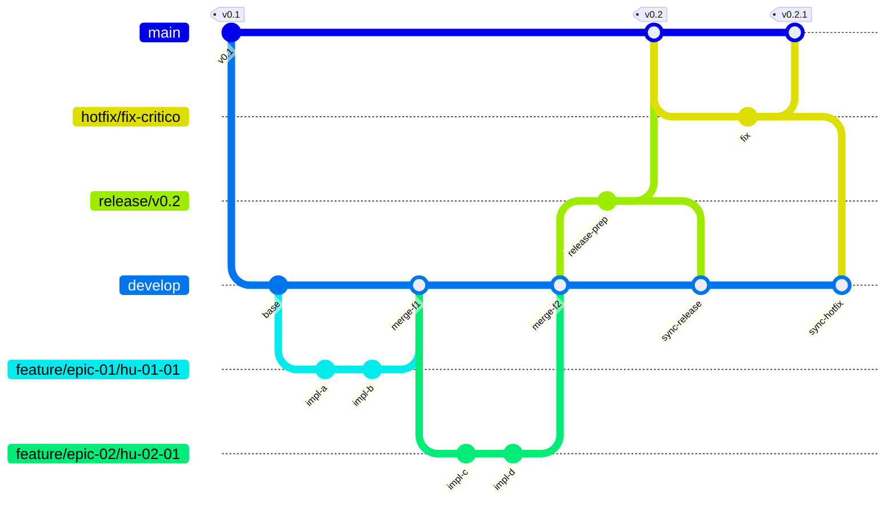

# Estrategia de branching: GitFlow

Este documento describe el modelo de ramificacion adoptado por el proyecto Codemon. El flujo es GitFlow, con las 5 ramas canonicas: `main`, `develop`, `release/*`, `hotfix/*` y `feature/*`.

Para la parte de gestion de issues, labels, story points y tablero GitHub Projects, ver [GITHUB_PROJECT_WORKFLOW.md](GITHUB_PROJECT_WORKFLOW.md). Para los criterios de merge y Definition of Done, ver [../04_proceso/DOD.md](../04_proceso/DOD.md).

---

## Diagrama



Lectura rapida:

- El orden visual replica el esquema clasico: `main`, `hotfix`, `release`, `develop`, `feature/*`.
- Aunque `hotfix/*` se dibuje entre `main` y `develop`, **no nace desde `develop`**. Nace desde `main`, vuelve a `main` y se sincroniza inmediatamente con `develop`.
- Con versionado semantico, un hotfix sobre `v0.2` genera `v0.2.1`. `v0.3` se reserva para una release minor normal desde `develop`.

---

## Versionado semantico

| Caso | Cambio SemVer | Ejemplo |
|---|---|---|
| Release normal desde `develop` | Minor o major, segun alcance | `v0.1` -> `v0.2`; `v0.2` -> `v1.0` |
| Hotfix desde `main` | Patch | `v0.2` -> `v0.2.1` |
| Correccion menor dentro de `release/*` antes de publicar | No crea tag aparte | sigue siendo `v0.2` |

Regla: un hotfix nunca deberia subir la minor version. Si la version productiva actual es `v0.2`, el fix urgente debe salir como `v0.2.1`, no como `v0.3`.

---

## Ramas del modelo

### `main` — produccion estable

| Propiedad | Valor |
|---|---|
| **Vida util** | Permanente |
| **Origen** | — (rama inicial) |
| **Mergea hacia** | — |
| **Quien mergea** | Tech Lead / PO (via PR aprobado) |
| **Tags de version** | Aqui se tagean todas las versiones (`v0.1`, `v0.2`, `v0.2.1`, `v1.0`) |

Regla: **nunca se hace push directo**. Solo recibe merges de `release/*` o `hotfix/*` a traves de un Pull Request.

---

### `develop` — integracion continua

| Propiedad | Valor |
|---|---|
| **Vida util** | Permanente |
| **Origen** | Se abre desde `main` una sola vez al inicio del proyecto |
| **Mergea hacia** | `release/*` al final del sprint |
| **Quien mergea** | Cualquier miembro del equipo (via PR aprobado) |

Regla: es la rama donde se integran todas las features terminadas. Debe compilar y pasar tests en todo momento.

---

### `feature/*` — implementacion de HU o TT

| Propiedad | Valor |
|---|---|
| **Vida util** | Durante la HU (dias a una semana) |
| **Origen** | `develop` |
| **Mergea hacia** | `develop` |
| **Quien crea** | El miembro del equipo asignado a la HU |

**Convencion de nombres:**

```
feature/<epic-slug>/<hu-id>-<descripcion-corta>
```

Ejemplos:

```
feature/epic-01/hu-01-03-login
feature/epic-04/hu-04-06-attack-pipeline
feature/epic-06/hu-06-02-board-ui
```

Regla: una feature branch por HU (o por TT si la TT es lo suficientemente grande). Se elimina despues del merge.

---

### `release/*` — preparacion de entrega

| Propiedad | Valor |
|---|---|
| **Vida util** | 1-2 dias (al final de cada sprint) |
| **Origen** | `develop` |
| **Mergea hacia** | `main` y `develop` |
| **Quien crea** | Tech Lead o miembro de Equipo C (DevOps) |

**Convencion de nombres:**

```
release/vX.Y
```

Ejemplos:

```
release/v0.1
release/v0.2
release/v1.0
```

En esta rama solo se permiten: ajustes de version, fixes menores de ultimo momento, actualizacion de changelogs. No se desarrollan features nuevas aqui.

Regla: al mergear a `main` se crea el tag de version. Al mergear de vuelta a `develop` se sincronizan los ajustes finales.

---

### `hotfix/*` — fix urgente en produccion

| Propiedad | Valor |
|---|---|
| **Vida util** | Horas (urgencia maxima) |
| **Origen** | `main` |
| **Mergea hacia** | `main` y `develop` |
| **Quien crea** | Tech Lead o responsable del area afectada |

**Convencion de nombres:**

```
hotfix/<descripcion-corta>
```

Ejemplos:

```
hotfix/jwt-expiration-null
hotfix/deck-validation-crash
```

Regla: solo para bugs criticos en produccion que no pueden esperar al proximo sprint. Al mergear a `main` se taggea una version patch (ej. `v0.2.1`). Se mergea inmediatamente tambien a `develop` para no perder el fix.

---

## Reglas de merge

| Origen | Destino | Condicion |
|---|---|---|
| `feature/*` | `develop` | PR aprobado por al menos 1 reviewer + DoD cumplido |
| `develop` | `release/*` | Solo al cierre del sprint, con Sprint Goal cumplido |
| `release/*` | `main` | PR aprobado por Tech Lead + smoke tests OK |
| `release/*` | `develop` | Inmediatamente despues del merge a `main` |
| `hotfix/*` | `main` | PR aprobado por Tech Lead (proceso fast-track) |
| `hotfix/*` | `develop` | Inmediatamente despues del merge a `main` |

**Nunca:**
- Push directo a `main` o `develop`
- Merge de `feature/*` directamente a `main`
- Merge de `feature/*` a otra `feature/*`

---

## Mapeo sprints → GitFlow

| Evento del sprint | Accion GitFlow |
|---|---|
| Inicio del sprint — comenzar una HU | `git checkout -b feature/epic-XX/hu-XX-YY-desc develop` |
| HU terminada + DoD cumplido | PR de `feature/*` hacia `develop`; merge con squash |
| Fin del sprint — entregable demoable | `git checkout -b release/vX.Y develop` → ajustes finales → merge a `main` (tag) y `develop` |
| Bug critico en produccion | `git checkout -b hotfix/descripcion main` → fix → merge a `main` (tag patch) y `develop` |
| Tag de version estable | Solo en `main`: `git tag -a vX.Y -m "Sprint SN — descripcion"` para releases; `git tag -a vX.Y.Z -m "Hotfix — descripcion"` para hotfixes |

### Ciclo tipico de un sprint

```
develop
  └── feature/epic-01/hu-01-03-login     ← lunes, inicio del sprint
      └── [commits de implementacion]
      └── PR → develop                   ← jueves, HU terminada
  └── feature/epic-10/tt-10-05-ci        ← martes, tarea tecnica paralela
      └── [commits]
      └── PR → develop                   ← jueves
  └── release/v0.2                       ← viernes, cierre del sprint
      └── [ajustes de version]
      └── PR → main (tag v0.2)
      └── merge back → develop
```

---

## Proteccion de ramas recomendada

Para `main` y `develop` se recomienda configurar en GitHub:

| Regla | `main` | `develop` |
|---|---|---|
| Requerir PR antes de mergear | Si | Si |
| Minimo de approvals | 1 | 1 |
| Requerir checks de CI | Si | Si |
| Prohibir push directo | Si | Si |
| Prohibir force push | Si | Si |
| Eliminar rama al mergear PR | N/A | Si (feature branches) |

---

## Relacion con el resto del workflow

| Necesito saber... | Documento |
|---|---|
| Como crear un issue, asignar SP, usar el tablero | [GITHUB_PROJECT_WORKFLOW.md](GITHUB_PROJECT_WORKFLOW.md) |
| Que criterios debe cumplir un PR para mergear | [../04_proceso/DOD.md](../04_proceso/DOD.md) |
| A que sprint pertenece una HU | [../01_backlog/PRODUCT_BACKLOG.md](../01_backlog/PRODUCT_BACKLOG.md) |
| Gates de sincronizacion entre equipos | [../04_proceso/DEPENDENCIAS_EPICAS.md](../04_proceso/DEPENDENCIAS_EPICAS.md) |
