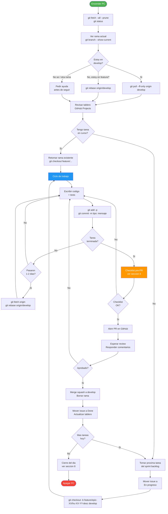
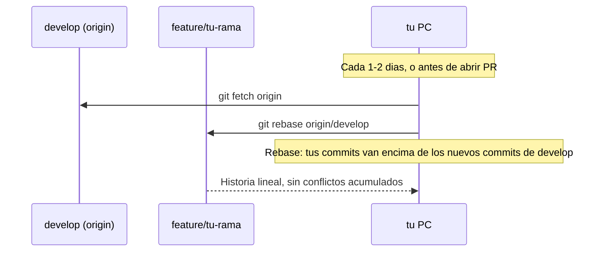
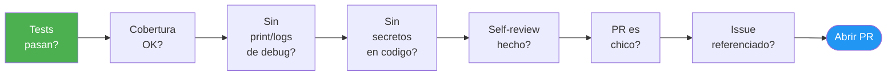
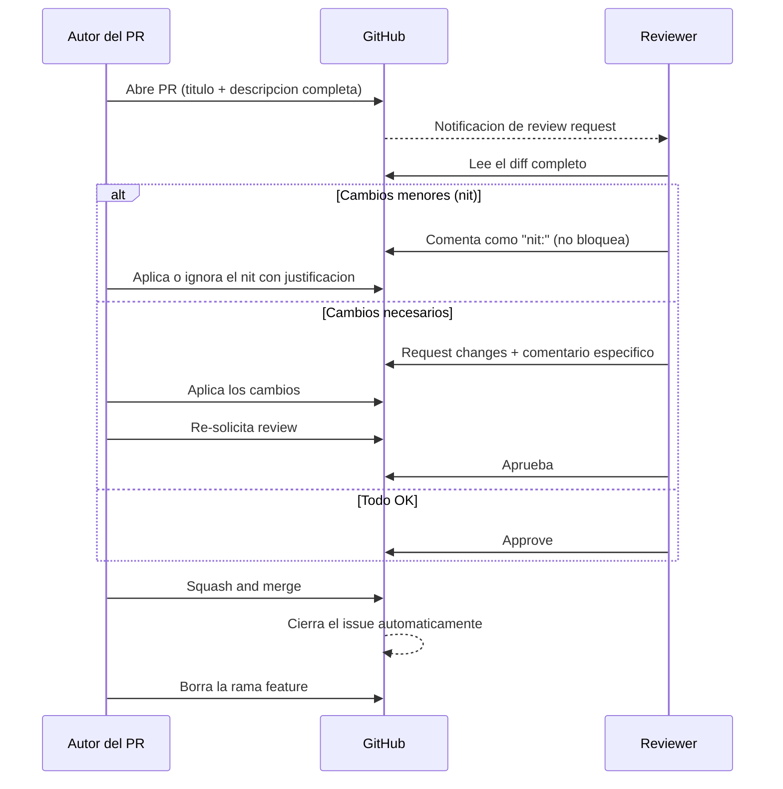

# Workflow diario del desarrollador — Codemon

Esta guia describe el ritual completo de un dia de trabajo: desde encender la PC hasta cerrarla. Aplica a los tres equipos (A, B, C). Los comandos especificos por equipo estan al final.

**Nota APB:** si un comando o regla no se entiende, no se ejecuta a ciegas. Al pie del documento estan los anexos de consulta: [guia de commits](#anexo-guia-de-commits) y [guia rapida de Git](#anexo-guia-rapida-y-glosario-de-git).

Referencias complementarias:
- Modelo de ramas: [GITFLOW.md](GITFLOW.md)
- Gestion del tablero: [GITHUB_PROJECT_WORKFLOW.md](GITHUB_PROJECT_WORKFLOW.md)
- Criterios de merge: [../04_proceso/DOD.md](../04_proceso/DOD.md)

---

## Diagrama: ciclo completo del dia



---

## 1. Inicio del dia

Lo primero antes de tocar cualquier archivo de codigo.

### Sincronizar el repositorio

```bash
git fetch --all --prune
git status
```

`--prune` elimina referencias locales a ramas remotas que ya fueron borradas (branches mergeados de otros). No modifica tu codigo; solo actualiza el mapa de ramas remotas.

Regla simple:

| Situacion | Comando | Que hace |
|---|---|---|
| Quiero saber si hay cambios remotos | `git fetch --all --prune` | Actualiza el mapa local de ramas remotas. No toca tus archivos. |
| Estoy en `develop` | `git pull --ff-only origin develop` | Actualiza `develop` solo si puede avanzar limpio, sin crear merge commits. |
| Estoy en `feature/*` | `git rebase origin/develop` | Reubica tus commits encima del ultimo `develop`. Puede pedir resolver conflictos. |
| No se en que rama estoy | `git branch --show-current` | Muestra el nombre de la rama actual. |

**No usar `git pull origin develop` dentro de una rama `feature/*`.** Puede mezclar `develop` en tu rama con un merge commit y ensuciar el historial. Para ramas de trabajo usamos `rebase`.

Si estas en tu rama de feature activa:

```bash
git fetch origin
git rebase origin/develop
```

Si estas en develop (para verificar estado):

```bash
git checkout develop
git pull --ff-only origin develop
git checkout feature/epic-XX/hu-XX-YY-desc
```

### Revisar el tablero

Abrir GitHub Projects y verificar:

- El estado de tus issues (debe estar en `En progreso`).
- Si hay algun comentario en tus PRs abiertos que requiera respuesta.
- Si algun gate del sprint cambio de estado (ver [DEPENDENCIAS_EPICAS.md](../04_proceso/DEPENDENCIAS_EPICAS.md)).

### Preparar el daily standup

Responder mentalmente las 3 preguntas antes de la reunion de las 9:30:

1. Que hice ayer?
2. Que voy a hacer hoy?
3. Tengo algun bloqueo?

---

## 2. Tomar una tarea

### Criterios para elegir la proxima tarea

1. **Primero:** tareas del sprint actual con estado `Pendiente` asignadas a tu equipo.
2. **Segundo:** tareas desbloqueadas segun la matriz de [DEPENDENCIAS_EPICAS.md](../04_proceso/DEPENDENCIAS_EPICAS.md).
3. **Tercero:** tareas con mayor prioridad (`Alta` antes que `Media`).
4. **Nunca:** tomar una tarea de otro sprint sin consultar al Tech Lead.

### Antes de empezar

1. Leer el `EPIC.md` correspondiente y la HU completa (criterios de aceptacion + RNF).
2. Confirmar que la HU cumple la Definition of Ready ([DOD.md — seccion DoR](../04_proceso/DOD.md)).
3. Mover el issue a `En progreso` en GitHub Projects.
4. Asignarte el issue si no lo esta.

---

## 3. Crear la rama y trabajar

### Crear la rama desde develop

```bash
git checkout develop
git pull --ff-only origin develop
git checkout -b feature/epic-XX/hu-XX-YY-descripcion
```

Formato obligatorio del nombre: `feature/<epic-slug>/<hu-id>-<descripcion-corta>`

```
feature/epic-01/hu-01-03-login
feature/epic-04/hu-04-06-attack-pipeline
feature/epic-06/hu-06-02-board-ui
```

Ver naming completo en [GITFLOW.md](GITFLOW.md).

---

### Commits durante el trabajo

Cada commit debe guardar un cambio logico y chico. No acumular "todo el dia" en un solo commit.

```bash
git add -p
git commit -m "tipo(scope): descripcion en imperativo"
```

Ejemplos validos:

```bash
git commit -m "feat(auth): add register endpoint"
git commit -m "test(auth): add register validation tests"
git commit -m "fix(auth): handle duplicate email on register"
```

Regla minima:

- Usar Conventional Commits: `feat`, `fix`, `test`, `refactor`, `docs`, `chore`, `perf`, `style`, `ci`.
- Escribir en imperativo: `add`, `fix`, `remove`, no `added`, `fixed`, `removes`.
- Evitar mensajes genericos: no usar `wip`, `varios cambios`, `arregle cosas`.

Para detalles, ejemplos y casos dudosos, ver [Anexo: guia de commits](#anexo-guia-de-commits).

---

### Mantener la rama actualizada



```bash
git fetch origin
git rebase origin/develop
```

Antes de hacer rebase, la rama debe estar limpia: `git status` no deberia mostrar archivos modificados sin commit. Si hay trabajo a medias, hacer commit o guardar con `git stash push -m "mensaje"`.

En criollo: `rebase` toma tus commits de la rama `feature/*`, los levanta temporalmente, actualiza la base con lo ultimo de `develop` y vuelve a poner tus commits arriba. No borra tu trabajo, pero si el mismo archivo cambio en ambos lados puede pedirte resolver conflictos.

Si la rama ya estaba pusheada, despues del rebase puede hacer falta actualizar el remoto con:

```bash
git push --force-with-lease origin feature/epic-XX/hu-XX-YY-desc
```

Usar `--force-with-lease` solo en tu propia rama `feature/*`. Si el PR ya esta en revision, avisar al reviewer antes de hacerlo.

Si hay conflictos durante el rebase:
```bash
# 1. Resolver el conflicto en el archivo
# 2. git add <archivo-resuelto>
# 3. git rebase --continue
# Si quieres abortar:
# git rebase --abort
```

**Por que rebase y no merge?** `rebase` mantiene la historia lineal y limpia. Los commits de tu feature quedan en orden cronologico sobre la punta de develop. Facilita el code review y el `git log`.

---

## 4. Checklist pre-PR

Antes de abrir el PR, hacer este checklist sin omitir pasos:



| # | Check | Comando de verificacion |
|---|---|---|
| 1 | Tests pasan localmente | `./mvnw test` / `ng test --watch=false` |
| 2 | Cobertura no cae por debajo del umbral | `./mvnw test jacoco:report` (abrir `target/site/jacoco/`) |
| 3 | Sin `System.out.println`, `console.log` ni `TODO` olvidados | `git diff develop..HEAD` |
| 4 | Sin secretos hardcodeados (tokens, passwords, API keys) | `git diff develop..HEAD \| grep -i "secret\|password\|token\|key"` |
| 5 | Self-review: leer tu propio diff completo | `git diff develop..HEAD` |
| 6 | PR acotado: idealmente menos de 400 lineas | `git diff develop..HEAD --stat` |
| 7 | El issue referenciado existe y esta actualizado | Verificar en GitHub Projects |

**Sobre el self-review:** leer el diff completo antes de abrir el PR como si fueras el reviewer. Es la tecnica mas efectiva para atrapar errores propios antes de que otro los vea.

---

## 5. Abrir el PR

### Formato del titulo

```
tipo(scope): descripcion — HU-XX-YY
```

Ejemplos:
```
feat(auth): login con JWT y refresh token — HU-01-03
fix(deck): corregir validacion de mazo vacio — HU-03-02
```

### Formato de la descripcion

```markdown
## Que hace este PR
Descripcion breve de los cambios funcionales.

## HU / Issue
Closes #<numero-de-issue>
Refs HU-XX-YY — <nombre de la HU>
Sprint: SN

## Cambios principales
- Archivo A: que cambio y por que
- Archivo B: que cambio y por que

## Tests
- [ ] Unit tests agregados/actualizados
- [ ] Cobertura >= 80% (>= 90% si es motor de juego)
- [ ] Tests pasan en local

## Checklist DoD
- [ ] Criterios de aceptacion cumplidos
- [ ] Sin secretos hardcodeados
- [ ] Sin logs de debug
- [ ] Self-review realizado
```

### Asignar reviewers

- **Feature de Equipo A** → al menos 1 miembro de Equipo A o Tech Lead.
- **Feature de Equipo B** → al menos 1 miembro de Equipo B.
- **Feature de Equipo C** → al menos 1 miembro de Equipo C o Tech Lead.
- **Cambio de contrato API/WS** → notificar a todos los equipos afectados.

---

## 6. Flujo de review



### Como autor cuando recibes comentarios

- Responder **todos** los comentarios antes de re-solicitar review (aunque sea con "Done" o con un contra-argumento).
- Si corriges algo, hacer un nuevo commit con `fix(scope): address review comments`.
- No hacer force push a un PR abierto en revision sin avisar al reviewer (dificulta ver los cambios). Si es necesario por un rebase, usar `git push --force-with-lease`, nunca `git push --force`.

### Como reviewer

- Revisar **logica, no estilo** (el estilo lo maneja el linter).
- Usar prefijos en comentarios: `nit:` (sugerencia menor), `blocker:` (debe cambiar), `question:` (duda sin bloquear).
- Aprobar en menos de 24 horas cuando sea posible para no bloquear al equipo.
- Si el PR es muy grande (> 600 lineas), pedir al autor que lo divida.

---

## 7. Despues del merge

```bash
# 1. Volver a develop y actualizarlo
git checkout develop
git pull --ff-only origin develop

# 2. Borrar la rama local
git branch -d feature/epic-XX/hu-XX-YY-desc

# 3. Borrar la rama remota (si GitHub no lo hizo automaticamente)
git push origin --delete feature/epic-XX/hu-XX-YY-desc

# 4. Verificar que develop compila y los tests pasan
./mvnw test          # Equipo A
ng test --watch=false # Equipo B
docker compose ps     # Equipo C
```

En GitHub Projects: mover el issue a `Done` si el bot no lo hizo automaticamente.

---

## 8. Cierre del dia

Antes de apagar la PC, verificar esta lista:

| # | Accion |
|---|---|
| 1 | Todo codigo en curso esta commiteado o en stash — nunca dejar trabajo sin guardar |
| 2 | La rama activa fue pusheada al remoto (`git push origin feature/...`) |
| 3 | El issue de GitHub Projects refleja el estado real |
| 4 | Si hay un bloqueo, esta documentado en el issue con etiqueta `Blocked` |
| 5 | Si termino algo, el PR esta abierto o el issue esta en `En revision` |

### Guardar trabajo en curso sin commitear

Si terminaste el dia con codigo a medias que no esta listo para commit:

```bash
# Opcion 1: WIP commit (lo mas comun)
git add -A
git commit -m "chore: wip — auth service partially implemented"
git push origin feature/epic-01/hu-01-03-login

# Opcion 2: Stash (si prefieres no ensuciar el historial)
git stash push -m "auth service wip"
# Al dia siguiente:
git stash pop
```

---

## Comandos de inicio por equipo

### Equipo A — Backend Core

```bash
# Infraestructura (si no esta corriendo)
docker compose up postgres redis minio minio_setup prometheus grafana -d

# Verificar que todo esta healthy
docker compose ps

# Correr el API
cd ~/codemon/api && ./mvnw spring-boot:run

# Correr tests
./mvnw test

# Ver cobertura (abrir target/site/jacoco/index.html)
./mvnw test jacoco:report

# Solo tests del motor de juego
./mvnw test -Dtest="GameContext*,AttackPipeline*,DamageCalculator*,Setup*"

# Logs en tiempo real
docker compose logs -f api
```

### Equipo B — Frontend Angular + Tailwind CSS

```bash
# Instalar dependencias (solo si hay cambios en package.json)
npm install

# Servidor de desarrollo con mocks activos
ng serve

# Tests unitarios
ng test --watch=false --browsers=ChromeHeadless

# Verificar que el MockInterceptor esta activo antes de arrancar
# Ver environment.ts: useMocks debe estar en true en desarrollo
# Ver MOCKS_FRONTEND.md para el interceptor completo
```

### Equipo C — DevOps + Backend Auxiliar

```bash
# Verificar estado de todos los servicios
docker compose ps

# Levantar toda la infra
docker compose up -d

# Logs de un servicio especifico
docker compose logs -f postgres
docker compose logs -f api

# Reiniciar un servicio
docker compose restart redis

# Consola de PostgreSQL
docker exec -it codemon_postgres psql -U codemon_user -d codemon_db
```

---

## Errores comunes y como evitarlos

| Error | Como evitarlo |
|---|---|
| Push directo a `develop` o `main` | Configurar branch protection. Nunca usar `git push` sin estar en una rama `feature/*` |
| Rama desactualizada con conflictos grandes | Hacer `rebase origin/develop` cada 1-2 dias |
| PR gigante (> 600 lineas) | Dividir la HU en sub-tareas si es muy grande. Un PR = una HU o TT |
| Secreto hardcodeado en el codigo | Usar variables de entorno. Revisar `git diff` antes de pushear |
| Tests que pasan en local pero fallan en CI | No mockear lo que no debes. Ver [DOD.md](../04_proceso/DOD.md) sobre uso de Testcontainers |
| Migration de Flyway ya ejecutada modificada | **Nunca editar** un `.sql` ya ejecutado. Crear una nueva migracion con numero siguiente |
| `develop` roto despues de un merge | El autor del PR es responsable de verificar que develop compila despues del merge |
| Conflict en `yarn.lock` / `package-lock.json` | Resolver siempre con `npm install` y commitear el resultado; nunca editar el lock a mano |

---

## Consejos extra APB

Pequenas reglas que evitan friccion en equipo. No reemplazan al criterio tecnico, pero ayudan a que todos trabajen parecido.

### Antes de codear

| Hacer | Evitar |
|---|---|
| Leer la HU completa, incluidos criterios de aceptacion y RNF | Empezar solo por el titulo del issue |
| Confirmar que la rama sale de `develop` actualizado | Crear ramas desde otra feature |
| Identificar que archivos o modulos probablemente vas a tocar | Cambiar codigo "ya que estoy" fuera del alcance |
| Preguntar temprano si hay una duda de negocio | Resolver reglas de negocio por intuicion |

### Durante el desarrollo

| Hacer | Evitar |
|---|---|
| Ejecutar tests chicos mientras avanzas | Dejar todos los tests para el final del dia |
| Hacer commits chicos cuando una idea queda estable | Guardar todo en un unico commit enorme |
| Revisar `git diff` antes de cada commit | Commitear archivos por accidente |
| Borrar logs de debug antes del PR | Dejar `console.log`, `System.out.println` o datos temporales |
| Mantener nombres claros en variables, tests y metodos | Compensar codigo confuso con comentarios largos |

### Para tests

| Hacer | Evitar |
|---|---|
| Testear la regla de negocio, no solo la linea feliz | Cubrir solo el caso mas facil |
| Nombrar tests con el comportamiento esperado | Nombres genericos como `test1` o `shouldWork` |
| Agregar casos borde cuando hubo un bug | Corregir bugs sin test que los capture |
| Mantener mocks simples y creibles | Mockear tanto que el test ya no pruebe el sistema real |

### Para PRs

| Hacer | Evitar |
|---|---|
| Explicar que cambia y por que | Poner solo "se implementa HU" |
| Incluir capturas si cambia UI | Hacer que el reviewer tenga que correr todo para ver un cambio visual |
| Dejar claro que tests corriste | Escribir "tests ok" sin detalle |
| Abrir PR chico y enfocado | Mezclar feature, refactor y cambios esteticos sin relacion |
| Marcar dudas conocidas en la descripcion | Esconder incertidumbres esperando que nadie las vea |

### Para reviews

| Hacer | Evitar |
|---|---|
| Comentar sobre comportamiento, mantenibilidad y riesgos | Bloquear por preferencias personales de estilo |
| Usar `nit:`, `question:` y `blocker:` | Escribir comentarios ambiguos como "esto esta mal" |
| Proponer alternativas concretas cuando sea posible | Pedir cambios sin explicar el problema |
| Aprobar si lo importante esta bien | Alargar la review por detalles que no bloquean |

### Para comunicacion y bloqueos

| Hacer | Evitar |
|---|---|
| Avisar bloqueos el mismo dia | Esperar al daily siguiente si estas trabado |
| Dejar comentario en el issue con contexto y evidencia | Decir "no funciona" sin error, captura ni comando |
| Pedir ayuda mostrando `git status`, error o logs relevantes | Mandar solo una frase suelta al chat |
| Actualizar el tablero cuando cambia el estado real | Que el tablero diga una cosa y la rama otra |

---

## Anexo: guia de commits

Esta seccion amplia el estandar de commits sin cortar el flujo diario. Consultarla cuando haya dudas sobre tipo, scope, cuerpo del mensaje o division de commits.

### Formato obligatorio

Cada commit debe seguir este formato:

```
tipo(scope): descripcion en imperativo, max 72 chars

[cuerpo opcional: explica el POR QUE, no el que]
```

### Tipos validos

| Tipo | Cuando usarlo | Ejemplo |
|---|---|---|
| `feat` | Nueva funcionalidad visible para el usuario | `feat(auth): add JWT refresh token endpoint` |
| `fix` | Correccion de un bug | `fix(deck): validate minimum 20 cards before save` |
| `test` | Agregar o corregir tests | `test(game): add null energy edge case to AttackPipeline` |
| `refactor` | Cambio interno sin cambio de comportamiento | `refactor(matchmaking): extract queue logic to service` |
| `docs` | Solo documentacion | `docs(api): add missing endpoint description in contracts` |
| `chore` | Tareas de mantenimiento (deps, config, build) | `chore(deps): update Spring Boot to 3.3.2` |
| `perf` | Mejora de performance | `perf(leaderboard): add index on score column` |
| `style` | Formato (espacios, comas, sin cambio de logica) | `style(auth): apply spotless formatting` |
| `ci` | Cambios en CI/CD | `ci: add jacoco coverage report to PR checks` |

### Reglas de un buen mensaje

- **Imperativo:** `add`, `fix`, `remove` — no `added`, `fixed`, `removes`.
- **Minusculas y sin punto final** en la primera linea.
- **Scope entre parentesis:** el modulo afectado (`auth`, `deck`, `game`, `matchmaking`, `shop`).
- **Primera linea max 72 caracteres.**
- **El cuerpo explica el POR QUE**, no el que (el codigo ya muestra el que).
- **Ser especifico:** `fix(auth): handle expired refresh token` dice mas que `fix(auth): fix bug`.
- **No mencionar archivos si no aporta:** el diff ya muestra los archivos modificados.
- **No escribir estados emocionales:** evitar `finally works`, `please work`, `fix again`, `oops`.

```
fix(game): prevent negative HP from bypassing KO check

HP could go below 0 when two simultaneous attacks resolved in the same
tick. Added Math.max(0, ...) guard in DamageCalculator before the KO
check runs.
```

### Como elegir el tipo y el scope

| Si el cambio... | Tipo sugerido | Ejemplo |
|---|---|---|
| Agrega una capacidad nueva | `feat` | `feat(deck): add card rarity filter` |
| Corrige un comportamiento incorrecto | `fix` | `fix(auth): reject expired refresh tokens` |
| Solo agrega o ajusta pruebas | `test` | `test(game): cover tied speed resolution` |
| Ordena codigo sin cambiar comportamiento | `refactor` | `refactor(shop): extract price calculator` |
| Cambia README, contratos o guias | `docs` | `docs(api): document login error responses` |
| Cambia configuracion, scripts o dependencias | `chore` | `chore(deps): bump angular testing libs` |
| Cambia pipeline, actions o checks | `ci` | `ci: run backend tests on pull requests` |

El `scope` debe responder: "que parte del sistema toca principalmente este commit?". Si toca varias partes, elegir el area dominante o usar un scope mas amplio.

| Bien | Evitar |
|---|---|
| `feat(auth): add password reset request` | `feat(files): change UserController` |
| `fix(game): apply weakness before resistance` | `fix(stuff): battle bug` |
| `test(deck): cover invalid card quantity` | `test(all): tests` |

### Que poner y que no poner

| Poner | No poner |
|---|---|
| La intencion del cambio | Una lista larga de archivos modificados |
| El caso de negocio o regla corregida | "Cambios varios" |
| La causa de un bug si se conoce | "No se por que fallaba" |
| El impacto visible para usuario, API o equipo | Detalles obvios del codigo |
| Referencia a HU o issue si ayuda | Links sueltos sin contexto |

Ejemplos APB:

| Situacion | Commit recomendado |
|---|---|
| Nueva pantalla de login | `feat(auth): add login form validation` |
| Bug al guardar mazos vacios | `fix(deck): reject empty deck before save` |
| Test de una regla de combate | `test(game): cover KO after poison damage` |
| Limpieza interna de servicio | `refactor(matchmaking): split queue assignment logic` |
| Ajuste de documentacion | `docs(workflow): clarify rebase steps` |

### Cuando usar cuerpo del commit

Usar cuerpo cuando la primera linea no alcanza para entender el contexto. No hace falta en commits simples.

Buen cuerpo:

```
fix(auth): reject reused refresh tokens

Refresh tokens were only checked by expiration date. This allowed an old
token to be reused after logout if it had not expired yet. The service now
marks tokens as revoked during logout and rejects them on refresh.
```

Mal cuerpo:

```
fix(auth): fix refresh

Changed RefreshTokenService.java and AuthController.java.
Also updated tests.
```

### Commits atomicos

Un commit = un cambio logico. No acumular "todo el dia" en un solo commit.

| Bien | Mal |
|---|---|
| `feat(auth): add register endpoint` | `varios cambios del dia` |
| `test(auth): add unit tests for register` | `wip` |
| `fix(auth): handle duplicate email on register` | `arregle cosas` |

Preguntas utiles antes de commitear:

1. Si alguien revierte este commit, revierte una sola idea?
2. El mensaje permite entender el cambio sin abrir el diff?
3. Los tests relacionados estan en el mismo commit o en uno inmediatamente cercano?
4. Este commit compila por si solo?

Si la respuesta a varias preguntas es "no", dividir el cambio en commits mas chicos.

---

## Anexo: guia rapida y glosario de Git

Este anexo existe para que nadie tenga que adivinar que hace un comando. Si Git muestra un mensaje que no entiendes, parar y pedir ayuda antes de repetir comandos al azar.

### Semaforo de comandos

| Riesgo | Comandos | Que significa |
|---|---|---|
| Verde | `git status`, `git diff`, `git log`, `git branch --show-current`, `git fetch` | Consultan informacion. No cambian tus archivos de trabajo. |
| Amarillo | `git checkout`, `git pull --ff-only`, `git rebase`, `git stash pop`, `git branch -d` | Cambian tu rama o tus archivos locales. Leer el mensaje de Git antes de seguir. |
| Rojo | `git push`, `git push --force-with-lease`, `git push origin --delete` | Cambian el remoto compartido. Usar solo sabiendo la rama destino. |

### Comandos frecuentes

| Comando | Cuando usarlo | Que hace |
|---|---|---|
| `git status` | Antes de empezar, antes de commitear, antes de rebasear | Muestra rama actual, archivos modificados y archivos listos para commit. |
| `git branch --show-current` | Cuando no sabes en que rama estas | Imprime el nombre de la rama actual. |
| `git fetch origin` | Antes de rebasear o revisar cambios remotos | Trae informacion nueva del remoto, pero no modifica tu codigo. |
| `git fetch --all --prune` | Al inicio del dia | Actualiza todas las ramas remotas y limpia referencias a ramas remotas borradas. |
| `git checkout develop` | Para moverte a `develop` | Cambia tu rama activa a `develop`. |
| `git pull --ff-only origin develop` | Estando parado en `develop` | Actualiza `develop` sin crear merge commits. Si no puede hacerlo limpio, falla y pide intervencion. |
| `git checkout -b feature/... develop` | Al comenzar una HU nueva | Crea una rama nueva desde `develop` y te mueve a ella. |
| `git add -p` | Antes de commitear cambios puntuales | Te deja elegir por partes que cambios entran al commit. |
| `git add -A` | Para guardar todo el trabajo local | Agrega todos los cambios al proximo commit. Usarlo con cuidado. |
| `git commit -m "tipo(scope): mensaje"` | Cuando cerraste un cambio logico | Guarda un punto de historia en tu rama local. |
| `git diff develop..HEAD` | Antes de abrir PR | Muestra que cambiaria tu rama contra `develop`. |
| `git rebase origin/develop` | En una rama `feature/*`, cada 1-2 dias o antes del PR | Reubica tus commits encima del ultimo `develop`. Mantiene la historia lineal. |
| `git rebase --continue` | Despues de resolver conflictos de rebase | Continua el rebase pausado por conflictos. |
| `git rebase --abort` | Si el rebase salio mal y quieres volver atras | Cancela el rebase y deja la rama como estaba antes de empezar. |
| `git push origin feature/...` | Al cerrar el dia o abrir PR | Sube tu rama local al remoto. |
| `git push --force-with-lease origin feature/...` | Despues de rebasear una rama ya pusheada | Actualiza tu rama remota solo si nadie mas la cambio mientras tanto. |
| `git stash push -m "mensaje"` | Si tienes trabajo a medias y necesitas limpiar la rama | Guarda cambios sin commit en una pila temporal. |
| `git stash pop` | Para recuperar el ultimo stash | Aplica el ultimo trabajo guardado y lo quita del stash. |
| `git branch -d feature/...` | Despues del merge | Borra la rama local si Git confirma que ya fue mergeada. |
| `git push origin --delete feature/...` | Despues del merge, si GitHub no borro la rama | Borra la rama remota. Confirmar dos veces el nombre antes de ejecutar. |

### Glosario rapido

| Termino | Explicacion APB |
|---|---|
| Rama | Linea de trabajo independiente. Permite trabajar sin tocar directamente `develop`. |
| `develop` | Rama compartida donde se integran los cambios aprobados. Debe estar estable. |
| `feature/*` | Rama de trabajo para una HU, bugfix o tarea tecnica. |
| `origin` | Nombre local del repositorio remoto, normalmente GitHub. |
| Local | Lo que existe en tu PC. |
| Remoto | Lo que existe en GitHub. |
| Commit | Foto guardada de un cambio logico. Debe ser chico y entendible. |
| Working tree | Tus archivos actuales en disco. Pueden tener cambios sin guardar en Git. |
| Staging / index | Zona intermedia de cambios que van a entrar al proximo commit. |
| `HEAD` | El commit actual donde estas parado. |
| Diff | Comparacion entre dos estados del codigo. Sirve para revisar que cambio. |
| PR / Pull Request | Pedido para integrar tu rama a `develop` mediante review. |
| Merge | Une dos ramas. Puede crear un commit de merge si las historias no son lineales. |
| Squash merge | Une un PR convirtiendo todos sus commits en un solo commit final en `develop`. |
| Rebase | Cambia la base de tu rama: pone tus commits encima de otra rama, normalmente `origin/develop`. |
| Conflicto | Git no puede decidir solo entre dos cambios sobre la misma zona de codigo. Hay que editar el archivo y elegir la version correcta. |
| Fast-forward | Actualizacion simple donde una rama solo avanza hasta un commit mas nuevo, sin mezclar historias. |
| Force push | Sobrescribe la historia remota de una rama. Evitarlo salvo indicacion clara. |
| `--force-with-lease` | Force push con cinturon de seguridad: falla si alguien mas cambio la rama remota. |
| Stash | Cajon temporal para guardar cambios sin hacer commit. Util para limpiar la rama antes de cambiar de contexto. |

### Reglas de oro cuando Git se complica

1. Leer el mensaje completo de Git antes de ejecutar otro comando.
2. Si aparece `CONFLICT`, resolver archivos, hacer `git add <archivo>` y seguir con `git rebase --continue`.
3. Si no entiendes el estado, ejecutar `git status` y pedir ayuda con esa salida.
4. Nunca usar `git push --force`; si realmente hace falta, usar `git push --force-with-lease` y solo sobre tu rama `feature/*`.
5. Nunca borrar ramas remotas (`git push origin --delete ...`) sin confirmar que el PR ya fue mergeado.
