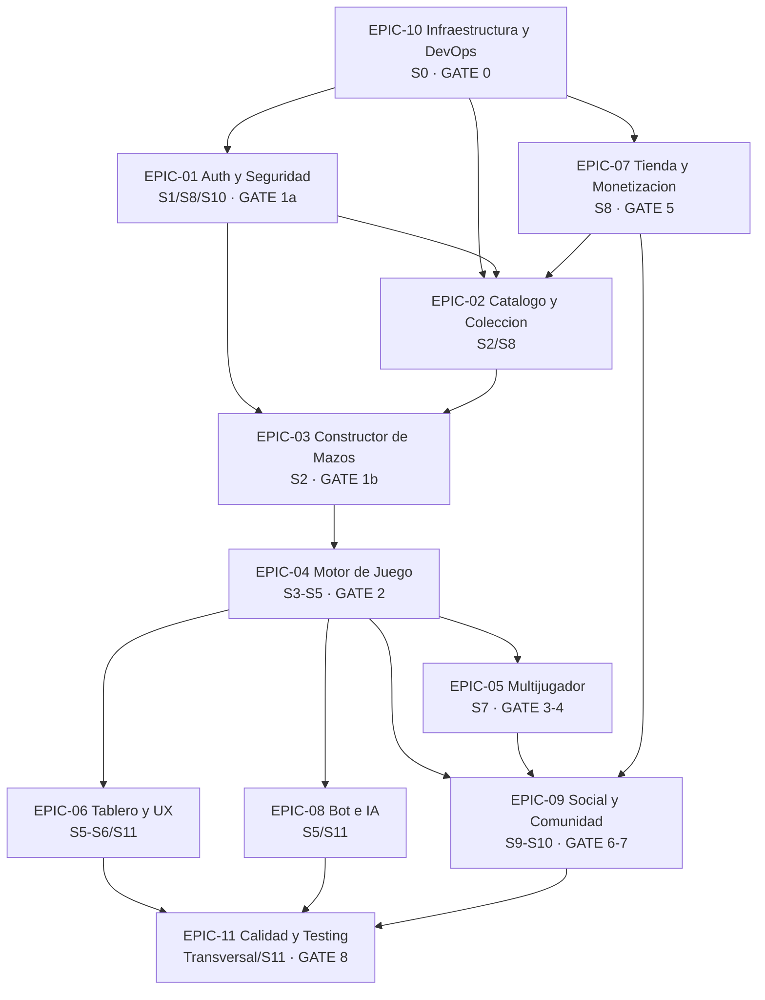

# Planificacion — Codemon TCG (metodologia Scrum)

> Reemplaza al antiguo `EPICAS_USER_STORIES_README.md` y al `INDEX.md` orientado a bloques tecnicos. Esta carpeta contiene todos los artefactos Scrum del proyecto.

> **Fuente canonica de gates:** la matriz completa vive en [04_proceso/DEPENDENCIAS_EPICAS.md](04_proceso/DEPENDENCIAS_EPICAS.md#gates-de-sincronizacion). Si otro documento difiere, gana esa matriz.

---

## Modelo de trabajo: Scrum

- **Sprints de 1 semana** (lunes a viernes; demo + retro el viernes).
- **3 equipos en paralelo** (A backend nucleo, B frontend, C backend auxiliar + DevOps).
- **Cada sprint entrega algo demoable y funcional** (skeleton, registro, partida, etc.).
- **9 epicas funcionales + 2 tecnicas** organizan el producto.
- **Contratos API/WS firmados desde el Sprint 0** (mock-first para frontend).

---

## Bird's-eye view del proyecto

Si solo lees esta seccion, la idea general es esta:

> Codemon TCG se planifica con Scrum, se divide en epicas, baja a HU/TT, se ejecuta por sprints semanales y se sincroniza entre equipos con gates. El frontend puede avanzar con mocks, pero solo integra funcionalidades reales cuando el gate correspondiente queda verde.

### Mapa mental

| Nivel | Que responde | Donde se ve |
|---|---|---|
| **Producto** | Que estamos construyendo | [ESPECIFICACION_PRODUCTO.md](../01-producto/ESPECIFICACION_PRODUCTO.md) |
| **Epicas** | Grandes areas de valor o tecnica | [03_epicas/](03_epicas/) |
| **HU / TT** | Trabajo concreto funcional o tecnico | [01_backlog/PRODUCT_BACKLOG.md](01_backlog/PRODUCT_BACKLOG.md) y [01_backlog/BACKLOG.md](01_backlog/BACKLOG.md) |
| **Sprints** | Cuando se hace | [02_sprints/SPRINTS.md](02_sprints/SPRINTS.md) |
| **Gates** | Cuando algo queda listo para que otro equipo lo use | [04_proceso/DEPENDENCIAS_EPICAS.md](04_proceso/DEPENDENCIAS_EPICAS.md#gates-de-sincronizacion) |
| **DoD / Checklist** | Como sabemos que esta terminado | [04_proceso/DOD.md](04_proceso/DOD.md) y [02_sprints/CHECKLIST_ENTREGA.md](02_sprints/CHECKLIST_ENTREGA.md) |
| **GitHub Projects** | Como se gestiona en GitHub | [00_guia/GITHUB_PROJECT_WORKFLOW.md](00_guia/GITHUB_PROJECT_WORKFLOW.md) |

### Diagrama general



### Flujo macro por sprints

| Sprint | Foco | Resultado esperado |
|---|---|---|
| **S0** | Infraestructura y contratos | Stack base, API/WS/mocks acordados |
| **S1** | Auth basica | Registro, login, logout, refresh |
| **S2** | Catalogo + mazos | Cartas, deck builder y validacion de mazo |
| **S3-S5** | Motor de juego | Setup, turnos, combate, WebSocket y PvE jugable |
| **S6-S7** | Tablero + PvP | UI jugable, lobby, salas y ranked |
| **S8** | Tienda + 2FA + coleccion | Pagos, sobres, wallet, metricas |
| **S9-S10** | Social + OAuth + perfil | Amigos, presencia, leaderboard, ligas, OAuth |
| **S11** | Calidad y pulido | Bots avanzados, responsive, Playwright, Lighthouse, carga |

### Equipos

| Equipo | Foco principal | Entrega tipica |
|---|---|---|
| **A** | Backend core, auth, cartas, mazos, motor, WebSocket | APIs y motor real para que B/C integren |
| **B** | Frontend Angular + Tailwind CSS, mock-first, tablero, lobby, tienda, perfil, E2E | UI usable primero con mocks y luego con endpoints reales |
| **C** | DevOps, Redis, matchmaking, pagos, leaderboard, OAuth, observabilidad | Infra e integraciones que desbloquean producto real |

### Gates principales

| Gate | Sprint | Que desbloquea |
|---|---|---|
| **GATE 0** | S0 | Todos pueden trabajar sobre infra y contratos comunes |
| **GATE 1a** | S1 | B cambia auth mock por Auth/JWT real |
| **GATE 1b** | S2 | B conecta catalogo y mazos reales |
| **GATE 2** | S5 | B conecta tablero real y C integra matchmaking con motor |
| **GATE 3** | S7 | B conecta salas privadas reales |
| **GATE 4** | S7 | B conecta matchmaking ranked real |
| **GATE 5** | S8 | B conecta tienda, pagos, wallet y sobres reales |
| **GATE 6** | S9 | B conecta leaderboard, ligas, amigos y noticias reales |
| **GATE 7** | S10 | B conecta OAuth2 y perfil consolidado |
| **GATE 8** | S11 | Todos cierran carga, Playwright, Lighthouse y entrega |

### Regla para no perderse

- Para **entender el orden del producto**, lee [02_sprints/SPRINTS.md](02_sprints/SPRINTS.md).
- Para **saber que trabaja cada equipo**, lee [04_proceso/EQUIPOS.md](04_proceso/EQUIPOS.md).
- Para **ver dependencias y gates**, lee [04_proceso/DEPENDENCIAS_EPICAS.md](04_proceso/DEPENDENCIAS_EPICAS.md).
- Para **implementar con IA**, usa [../../docs/08-desarrollo-con-ia/README.md](../../docs/08-desarrollo-con-ia/README.md) y un solo `PASO_*.md` por vez.

---

## Mapa de artefactos en esta carpeta

### Guia y navegacion

| Archivo | Para que sirve |
|---|---|
| [GITHUB_PROJECT_WORKFLOW.md](00_guia/GITHUB_PROJECT_WORKFLOW.md) | Mapa entre Scrum, GitHub Projects v2, issues, labels, sprints y SP |
| [GITFLOW.md](00_guia/GITFLOW.md) | Estrategia GitFlow: ramas, naming, reglas de merge y mapeo a sprints |
| [WORKFLOW_DIARIO.md](00_guia/WORKFLOW_DIARIO.md) | Ritual diario del desarrollador: inicio del dia, git flow, commits, PR, review y cierre |
| [LISTADO_COMPLETO_ARCHIVOS.md](00_guia/LISTADO_COMPLETO_ARCHIVOS.md) | Inventario completo de archivos del repo |

### Vista del producto

| Archivo | Para que sirve |
|---|---|
| [PRODUCT_BACKLOG.md](01_backlog/PRODUCT_BACKLOG.md) | Tabla maestra: 11 epicas + ~63 HU priorizadas por valor |
| [SPRINTS.md](02_sprints/SPRINTS.md) | Plan de los 12 sprints con Sprint Goal y entregable demoable |
| [BACKLOG.md](01_backlog/BACKLOG.md) | Backlog operativo ordenado por sprint con HU + TT detalladas |
| [epicas_y_user_stories.csv](01_backlog/epicas_y_user_stories.csv) | Volcado tabular para importar a Jira/Trello/etc |

### Reglas y proceso

| Archivo | Para que sirve |
|---|---|
| [DOD.md](04_proceso/DOD.md) | Definition of Ready + Definition of Done global y por epica |
| [DEPENDENCIAS_EPICAS.md](04_proceso/DEPENDENCIAS_EPICAS.md) | Mapa de dependencias entre epicas + gates de sincronizacion |
| [EQUIPOS.md](04_proceso/EQUIPOS.md) | Estructura de los 3 equipos, capacity, asignacion por sprint |
| [CONTRATOS_INDEX.md](04_proceso/CONTRATOS_INDEX.md) | Mapeo endpoint REST / evento STOMP -> HU que lo demanda |

### Verificacion

| Archivo | Para que sirve |
|---|---|
| [CHECKLIST_ENTREGA.md](02_sprints/CHECKLIST_ENTREGA.md) | Items a marcar al cerrar cada sprint y la entrega final |
| [BACKLOG_REGLAS_POST_MVP.md](01_backlog/BACKLOG_REGLAS_POST_MVP.md) | 11 reglas TCG no-MVP para iteraciones futuras |

### Seguimiento operativo

| Archivo | Para que sirve |
|---|---|
| [../../docs/08-desarrollo-con-ia/ESTADO_PASOS.md](../../docs/08-desarrollo-con-ia/ESTADO_PASOS.md) | Estado actual por `PASO_*.md`: responsable, avance, bloqueos y proxima accion |
| [../../docs/08-desarrollo-con-ia/HISTORIAL_PASOS.md](../../docs/08-desarrollo-con-ia/HISTORIAL_PASOS.md) | Bitacora cronologica de cambios de estado, pausas, checks y handoffs |

### Carpetas por epica

Cada `EPIC-XX-NOMBRE/` contiene un unico `EPIC.md` con:
- Resumen y valor de negocio.
- Historias de Usuario (HU) en formato **Como/Quiero/Para** con AC y RNF.
- Tareas Tecnicas (TT) con referencia al `PASO_*.md` original.
- Contratos involucrados (REST + STOMP).
- DoD especifico de la epica.

| Carpeta | Tipo | HU |
|---|---|---|
| [EPIC-01-AUTH](03_epicas/EPIC-01-AUTH/EPIC.md) | Funcional | 7 |
| [EPIC-02-COLECCION](03_epicas/EPIC-02-COLECCION/EPIC.md) | Funcional | 5 |
| [EPIC-03-MAZOS](03_epicas/EPIC-03-MAZOS/EPIC.md) | Funcional | 6 |
| [EPIC-04-MOTOR](03_epicas/EPIC-04-MOTOR/EPIC.md) | Funcional | 9 |
| [EPIC-05-MULTIJUGADOR](03_epicas/EPIC-05-MULTIJUGADOR/EPIC.md) | Funcional | 5 |
| [EPIC-06-TABLERO](03_epicas/EPIC-06-TABLERO/EPIC.md) | Funcional | 6 |
| [EPIC-07-TIENDA](03_epicas/EPIC-07-TIENDA/EPIC.md) | Funcional | 6 |
| [EPIC-08-BOT](03_epicas/EPIC-08-BOT/EPIC.md) | Funcional | 5 |
| [EPIC-09-SOCIAL](03_epicas/EPIC-09-SOCIAL/EPIC.md) | Funcional | 8 |
| [EPIC-10-INFRA](03_epicas/EPIC-10-INFRA/EPIC.md) | Tecnica | 0 (solo TT) |
| [EPIC-11-CALIDAD](03_epicas/EPIC-11-CALIDAD/EPIC.md) | Tecnica | 0 (solo TT) |

---

## Convenciones

### IDs

| Tipo | Formato | Ejemplo |
|---|---|---|
| Epica | `EPIC-XX` | `EPIC-04` |
| Historia de Usuario | `HU-XX-YY` (XX=epica, YY=numero dentro de la epica) | `HU-04-06` |
| Tarea Tecnica | `TT-XX-YY` | `TT-10-07` |
| Sprint | `S0`..`S11` | `S5` |
| Gate de sincronizacion | `GATE-N` o nombre | `GATE 2` |

### Formato de HU

```markdown
### HU-XX-YY — Nombre breve

**Como** <rol>, **quiero** <accion>, **para** <beneficio>.

**Story Points:** N (Fibonacci: 1, 2, 3, 5, 8, 13, 21)

**Criterios de Aceptacion:**
- AC1: Dado ... cuando ... entonces ...

**Requerimientos No Funcionales:**
- RNF-Categoria: descripcion
```

### Story Points (Fibonacci)

| SP | Tiempo aprox | Cuando usarlo |
|---|---|---|
| 1 | <30 min | trivial |
| 2 | 1-2 h | simple |
| 3 | 2-3 h | claro y acotado |
| 5 | 3-5 h | esfuerzo medio |
| 8 | 5-7 h | complejo o con integracion |
| 13 | 8-10 h | grande, con riesgo |
| 21 | 10-15 h | enorme, partir si es posible (excepto AttackPipeline que es indivisible) |

---

## Mantenimiento del backlog

Cada vez que se cree, modifique o elimine una HU/TT:

1. **Actualizar el `EPIC.md`** correspondiente (es la fuente canonica de la HU).
2. **Actualizar [PRODUCT_BACKLOG.md](01_backlog/PRODUCT_BACKLOG.md)** (vista priorizada).
3. **Actualizar [BACKLOG.md](01_backlog/BACKLOG.md)** (vista por sprint).
4. **Actualizar [epicas_y_user_stories.csv](01_backlog/epicas_y_user_stories.csv)** (volcado tabular).
5. **Actualizar [SPRINTS.md](02_sprints/SPRINTS.md)** si cambia la planificacion.
6. **Actualizar [CONTRATOS_INDEX.md](04_proceso/CONTRATOS_INDEX.md)** si introduce o cambia un endpoint/evento.
7. **Verificar [DEPENDENCIAS_EPICAS.md](04_proceso/DEPENDENCIAS_EPICAS.md)** si se generan nuevas dependencias.
8. **Actualizar [../../docs/08-desarrollo-con-ia/ESTADO_PASOS.md](../../docs/08-desarrollo-con-ia/ESTADO_PASOS.md)** si cambia el estado real de un `PASO_*.md`.
9. **Registrar en [../../docs/08-desarrollo-con-ia/HISTORIAL_PASOS.md](../../docs/08-desarrollo-con-ia/HISTORIAL_PASOS.md)** todo cambio de estado, pausa, bloqueo, verificacion o cierre.

> **Fuente canonica de cada HU:** el `EPIC.md` correspondiente. Si hay contradicciones entre archivos, gana el `EPIC.md`.

---

## Ceremonias Scrum

| Evento | Cuando | Duracion | Quien |
|---|---|---|---|
| Sprint Planning | Lunes 9:00 | 1 h | TODOS los equipos |
| Daily Stand-up | Cada dia 9:30 | 15 min | TODOS por separado, sync rapido si hace falta |
| Refinamiento | Miercoles 14:00 | 1 h | PO + lideres tecnicos |
| Sprint Review (demo) | Viernes 14:00 | 45 min | TODOS + stakeholders |
| Retrospectiva | Viernes 15:00 | 45 min | TODOS |

---

## Relacion con `docs/08-desarrollo-con-ia/pasos/`

Los `PASO_*.md` originales (60+ archivos) se mantienen como **guias de implementacion detallada**. Cada Tarea Tecnica del backlog Scrum cita el o los `PASO_*.md` correspondientes en su columna "Origen". Asi:

- **Vista agil** (este folder): que problema resolvemos para el usuario, AC, RNF, sprint.
- **Vista de implementacion** ([pasos/](../08-desarrollo-con-ia/pasos/)): como implementarlo paso a paso, con clases, errores comunes y verificacion.

Ambas vistas son consistentes y se actualizan juntas.

El avance operativo no se deduce del backlog: se registra explicitamente en [ESTADO_PASOS.md](../../docs/08-desarrollo-con-ia/ESTADO_PASOS.md). Cuando un paso cambia de estado, el cambio queda asentado en [HISTORIAL_PASOS.md](../../docs/08-desarrollo-con-ia/HISTORIAL_PASOS.md).

---

## Glosario rapido

| Termino | Significado |
|---|---|
| Epica | Agrupacion funcional de valor para el usuario (ej. "Autenticacion") |
| HU | Historia de Usuario en formato Como/Quiero/Para |
| AC | Criterio de Aceptacion (Given/When/Then) |
| RNF | Requerimiento No Funcional (performance, seguridad, etc.) |
| TT | Tarea Tecnica (no es HU, es trabajo de habilitacion) |
| SP | Story Points (Fibonacci) |
| Sprint | Iteracion de 1 semana con entregable demoable |
| Sprint Goal | Objetivo unico del sprint, claro y verificable |
| DoR | Definition of Ready (la HU esta lista para entrar al sprint) |
| DoD | Definition of Done (la HU esta terminada) |
| Gate | Punto de sincronizacion entre equipos donde se valida un entregable |
| PO | Product Owner |
| SM | Scrum Master |
