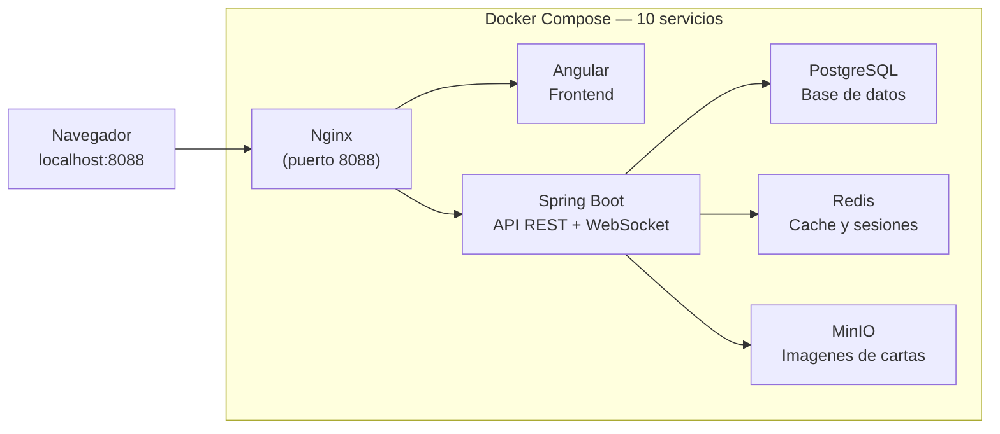

# Guia del primer dia — Codemon TCG

Esta guia es para quien se incorpora al proyecto y nunca trabajo con este stack antes. En 30 minutos deberias tener el proyecto corriendo y saber donde buscar cada cosa.

> Si ya conoces Docker, Spring Boot y Angular: podes saltarte las secciones 1 y 2 e ir directo a la seccion 3.

---

## 1. Prerequisitos — instalar antes de clonar

| Herramienta | Version minima | Descargar | Verificar |
|---|---|---|---|
| **Git** | 2.x | https://git-scm.com | `git --version` |
| **Docker Desktop** | 24+ | https://www.docker.com/products/docker-desktop | `docker --version` |
| **Java 21 JDK** | 21 LTS | https://adoptium.net | `java -version` |
| **Node.js** | 20 LTS | https://nodejs.org | `node --version` |
| **IntelliJ IDEA** | Community | https://www.jetbrains.com/idea | — |

> **macOS solamente:** si usas Colima en lugar de Docker Desktop, reemplaza `docker compose` por `docker --context colima compose` en todos los comandos de esta guia.

Si no sabes que es alguna de estas herramientas, leer antes [../01-producto/TECNOLOGIAS.md](../01-producto/TECNOLOGIAS.md) — tiene una explicacion en lenguaje simple de cada una.

---

## 2. Como esta estructurado el proyecto



**Lo que necesitas saber:**
- Todo corre dentro de Docker — no hace falta instalar PostgreSQL, Redis ni MinIO por separado.
- El unico puerto que se expone al navegador es el **8088** (Nginx enruta todo desde ahi).
- El backend (Spring Boot) y el frontend (Angular) son dos proyectos separados pero se sirven juntos a traves de Nginx.

---

## 3. Levantar el proyecto por primera vez

Seguir estos pasos en orden. Si algo falla, ir a la seccion "Problemas comunes" al final.

```bash
# 1. Clonar el repositorio
git clone <url-del-repo>
cd codemon

# 2. Crear el archivo de variables de entorno
cp .env.example .env
# Abrir .env y completar los valores que digan <completar>
# En desarrollo local, la mayoria de valores por defecto ya funcionan

# 3. Levantar todos los servicios
docker compose up -d

# 4. Verificar que todo esta corriendo
docker compose ps
# Todos los servicios deben mostrar estado "healthy" o "running"

# 5. Abrir el proyecto en el navegador
# http://localhost:8088
```

El primer `docker compose up` tarda varios minutos porque descarga las imagenes base. Los arranques siguientes son rapidos.

---

## 4. Verificar que todo funciona

| Que verificar | Como | Respuesta esperada |
|---|---|---|
| Todos los servicios | `docker compose ps` | Estado `healthy` en postgres, redis, minio |
| API respondiendo | `curl localhost:8088/actuator/health` | `{"status":"UP"}` |
| Frontend cargando | Abrir `http://localhost:8088` en el browser | Pantalla de inicio de Codemon |
| Base de datos | `docker exec -it codemon_postgres psql -U codemon_user -d codemon_db -c "SELECT version();"` | Version de PostgreSQL |
| Panel de archivos | Abrir `http://localhost:9001` | Panel de MinIO (usuario/pass en `.env`) |

Si algun servicio no esta healthy, el primer lugar para mirar es sus logs: `docker compose logs -f <nombre-servicio>`.

---

## 5. Comandos esenciales — "Quiero hacer X"

| Quiero... | Comando | Notas |
|---|---|---|
| **Levantar todos los servicios** | `docker compose up -d` | El `-d` los corre en segundo plano |
| **Ver si todo esta corriendo** | `docker compose ps` | Muestra estado de cada contenedor |
| **Ver los logs del API** | `docker compose logs -f api` | `-f` hace follow (en tiempo real) |
| **Ver los logs del frontend** | `docker compose logs -f front` | |
| **Ver los logs de la base de datos** | `docker compose logs -f postgres` | |
| **Parar todos los servicios** | `docker compose stop` | Conserva los datos |
| **Parar y eliminar contenedores** | `docker compose down` | Conserva los volumenes (datos) |
| **Resetear todo (nuclear)** | `docker compose down -v` | **Borra todos los datos.** Util si la BD quedo corrupta |
| **Reiniciar un servicio especifico** | `docker compose restart redis` | Reemplazar `redis` por el servicio |
| **Conectarme a la base de datos** | `docker exec -it codemon_postgres psql -U codemon_user -d codemon_db` | Consola de PostgreSQL interactiva |
| **Correr los tests del backend** | `./mvnw test` | Desde la carpeta `api/` |
| **Correr el frontend en modo dev** | `ng serve` | Desde la carpeta `front/` — recarga automatica |
| **Ver la cobertura de tests** | `./mvnw test jacoco:report` | Abrir `api/target/site/jacoco/index.html` |
| **Ver que rama estoy** | `git branch` | La activa tiene `*` |
| **Actualizar mi rama con develop** | `git fetch origin && git rebase origin/develop` | Hacer esto cada 1-2 dias |

---

## 6. Que leer despues (orden recomendado)

| # | Archivo | Para que sirve | Tiempo aprox |
|---|---|---|---|
| 1 | [../01-producto/TECNOLOGIAS.md](../01-producto/TECNOLOGIAS.md) | Entender que es cada herramienta del stack y por que se eligio | 30 min |
| 2 | La guia de tu equipo ([A](GUIA_EQUIPO_A.md), [B](GUIA_EQUIPO_B.md) o [C](GUIA_EQUIPO_C.md)) | Todo lo que necesitas saber para trabajar en tu area especifica | 1 hora |
| 3 | [../02-planificacion/README.md](../02-planificacion/README.md) | La metodologia Scrum del proyecto, gates y sprints | 20 min |
| 4 | [../02-planificacion/00_guia/WORKFLOW_DIARIO.md](../02-planificacion/00_guia/WORKFLOW_DIARIO.md) | El ritual diario: fetch, rama, commits, PR, review | 15 min |
| 5 | [../02-planificacion/00_guia/GITFLOW.md](../02-planificacion/00_guia/GITFLOW.md) | Como se manejan las ramas en este proyecto | 10 min |
| 6 | [../02-planificacion/04_proceso/DOD.md](../02-planificacion/04_proceso/DOD.md) | Cuando algo esta "terminado" (Definition of Done) | 20 min |

---

## 7. Problemas comunes

| Problema | Causa probable | Solucion |
|---|---|---|
| `docker compose ps` muestra algun servicio en `Exit` | El contenedor crasheo al arrancar | `docker compose logs -f <servicio>` para ver el error |
| Puerto 8088 ocupado | Otro proceso usa ese puerto | `lsof -i :8088` para ver cual, luego cerrarlo |
| `{"status":"DOWN"}` en `/actuator/health` | La BD no termino de arrancar | Esperar 30 segundos y reintentar; si persiste ver logs de postgres |
| `Migration checksum mismatch` en los logs | Se edito un archivo `.sql` de Flyway ya ejecutado | `docker compose down -v && docker compose up -d` — **borra los datos** |
| `ng serve` da error de dependencias | Falta `npm install` | `cd front && npm install` |
| La pagina en 8088 no carga el frontend | El build de Angular no termino | Esperar 1-2 minutos y recargar; ver `docker compose logs -f front` |

Si el problema no esta en esta tabla, buscar en los logs del servicio afectado y consultar la guia de tu equipo.
